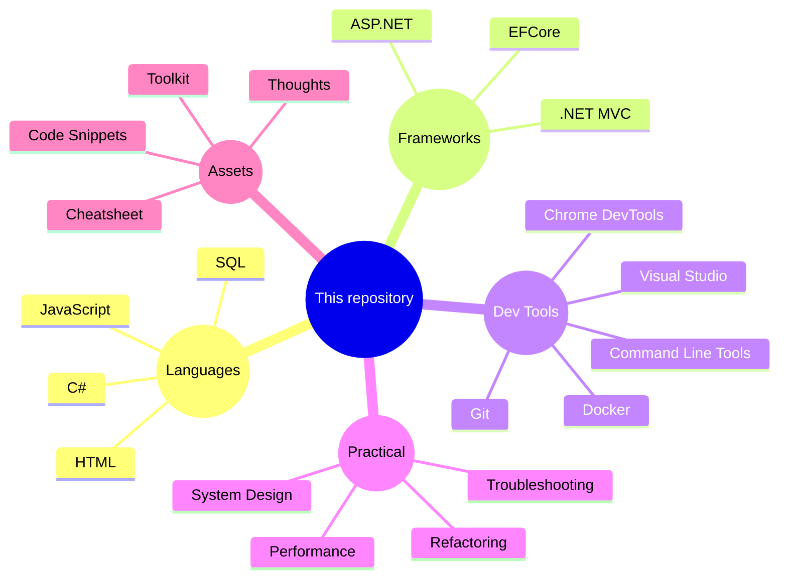

# dev-toolkit-and-notes

```mermaid
mindmap
  root((This repository))

      root((Languages))
        C#
        SQL
        JavaScript
        HTML

      root((Frameworks))
        ASP.NET
        .NET MVC
        EFCore

      root((Dev Tools))
        Visual Studio
        Chrome DevTools
        Git
        Docker
        Command Line Tools

      root((Practical))
        Refactoring
        Troubleshooting
        Performance
        System Design

      root((Assets))
        Cheatsheet
        Code Snippets
        Thoughts
        Toolkit
```
