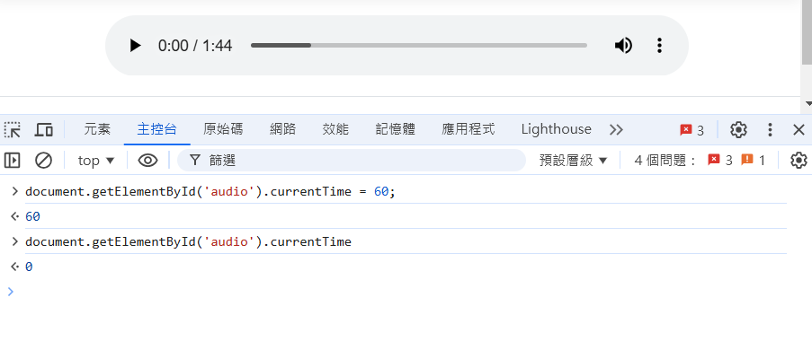
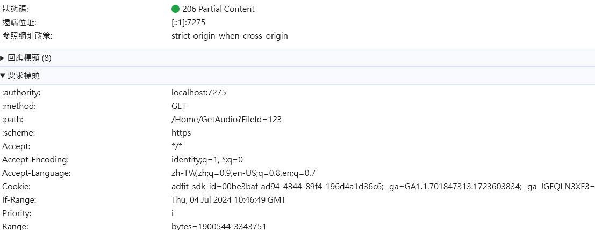
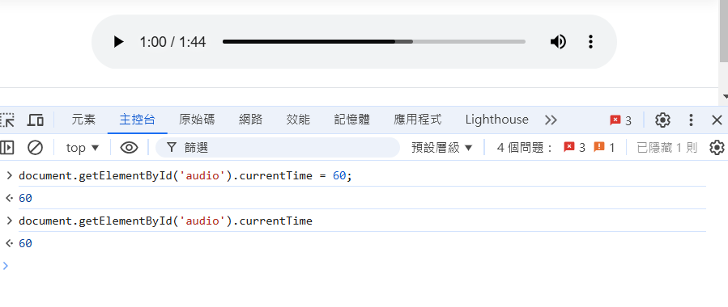

# ASP.NET Core MVC Audio Seeking Troubleshooting

- 問題背景：ASP.NET Core MVC 網站有一個音檔播放頁面，在網頁中使用 JavaScript 設定 audio.currentTime 播放時間點後 currentTime 被重置為 0，無法跳轉到指定時間，或是透過 UI 點選 audio 時間也無法直接播放


- 網站音訊檔案不放置於網站內部，由資料庫讀出存放路徑再使用 `PhysicalFile` 方法回傳，Server 端程式示意：
```csharp
public IActionResult GetAudio(long FileId)
{
    string physicalPath = GetPhysicalPath(FileId);
    return PhysicalFile(physicalPath, "application/octet-stream", "example.wav");
}
```

## 處理過程
- 觀察 Network 發現當時的實作中 Server 回應 status code 為 200，而其他可正常 Seeking 的影音串流網站回應 status code 為 206，判斷可能是因為未正確回應 HTTP Range Requests，而導致 Audio Seeking 失效

- 將 Server 端程式修改，將 `enableRangeProcessing` 參數設為 true 可支援 Range Requests 處理：
```csharp
public IActionResult GetAudio(long FileId)
{
    string physicalPath = GetPhysicalPath(FileId);
    return PhysicalFile(physicalPath, "application/octet-stream", "example.wav", true);
}
```
- 修改後回應 status code 為 206


- 修改後在網頁中可正常設定 currentTime


- 範例：[ExampleController](ExampleController.cs)

## 參考
- [Microsoft](https://learn.microsoft.com/zh-tw/dotnet/api/microsoft.aspnetcore.mvc.controllerbase.physicalfile?view=aspnetcore-8.0)
