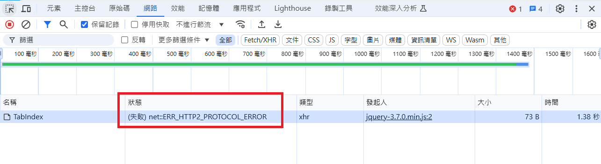
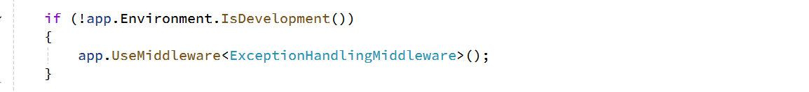
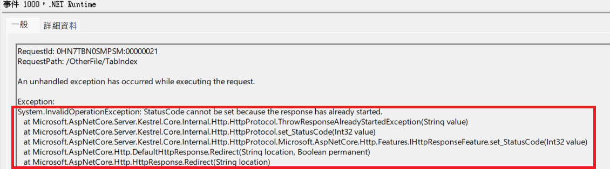

# ASP.NET Core MVC ERR_HTTP2_PROTOCOL_ERROR Troubleshooting

- 問題背景：ASP.NET Core MVC 網站在執行到特定功能時沒有反應，瀏覽器 Network 觀察到請求 `net::ERR_HTTP2_PROTOCOL_ERROR` 錯誤

## 錯誤訊息



## 處理過程

- 此狀況只發生在特定請求發生異常時，其他功能則回應正常
- 系統有使用自定義的 `ExceptionHandlingMiddleware` 處理異常


## 主要問題

在開發環境將 `UseMiddleware` 啟用，自己手動拋出 Exception 後重現此錯誤，問題出在 `ExceptionHandlingMiddleware.cs` 的錯誤處理邏輯中：

```csharp
public async Task InvokeAsync(HttpContext httpContext)
{
    try
    {
        await _next(httpContext);
    }
    catch (Exception ex)
    {
        HandleExceptionAsync(httpContext, ex);
    }
}

private void HandleExceptionAsync(HttpContext context, Exception exception)
{
    // ...
    string code_id = LogUtil.LogError(exception.ToString(), context.Request.GetDisplayUrl());
    context.Response.ContentType = "text/plain; charset=utf-8";
    context.Response.WriteAsync($"code_id = {code_id}"); 
    context.Response.Redirect($"/Error?code_id={code_id}");
}

```

- 問題原因：在同一個 Response 中同時調用了 WriteAsync 和 Redirect，而 HTTP/2 協議不允許在已經開始寫入 Response Body 後再修改 Response Header

- 事件檢視器也有顯示這個錯誤訊息


## 問題修正

明確定義異常處理的回應方式：重定向或直接返回錯誤代碼擇一