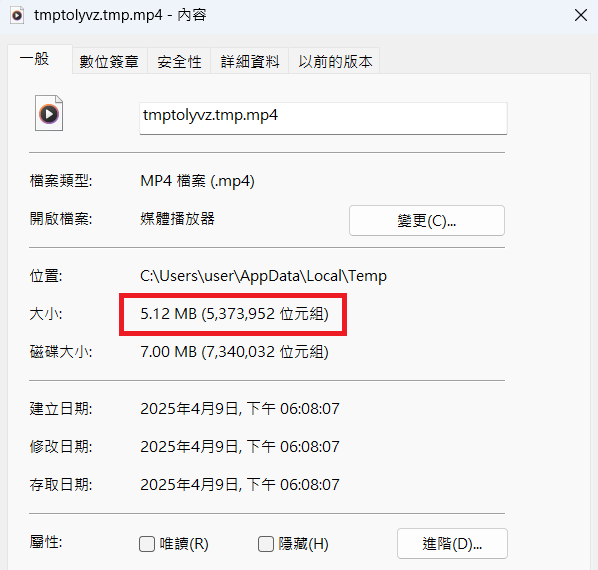

# ASP.NET Core MVC FileUpload and Process Troubleshooting

- 問題背景：ASP.NET Core MVC 網站會將上傳的檔案暫存，之後使用 `FFMpeg` 嘗試讀取剛上傳的檔案進行剪輯轉檔，發生轉檔錯誤。但是程式停止後手動對相同的檔案轉檔卻成功。


## 示意程式

- 程式行為：將上傳的檔案保存至暫存檔（路徑為 `tmpSave`），之後使用 `FFMpeg` 對該檔案進行處理

```csharp
public IActionResult SendFile(SendFileViewModel vm)
{
    // ...
    using var stream = new FileStream(tmpSave, FileMode.Create);
    uploadFile.CopyTo(stream);
    TrimAudioByFFMpeg(tmpSave, tmpConvert, startTime, endTime);
    // ...
}
```

## 處理過程

- 在 `TrimAudioByFFMpeg` 執行前中斷程式執行觀察暫存檔，發現此時檔案大小確實與原檔案不一致，直到`SendFile` 方法結束為止。

- `FFMpeg` 處理時檔案  


- `SendFile` 方法結束時檔案  


- 使用 C# 的 using declaration（例如 `using var stream = ...;`）會在包含該宣告的 scope 結束時自動呼叫 `Dispose()`。在原始程式中，這個 scope 是 `SendFile` 方法本身，因此在呼叫 `TrimAudioByFFMpeg(...)` 時，`FileStream` 尚未被關閉（尚未執行 `Dispose()`），可能導致資料尚未完全寫入或檔案被鎖定，進而讓 FFmpeg 讀取失敗或判定為格式錯誤。

## 調整程式

- 明定 `FileStream` 的 scope，讓檔案寫入完成後立刻呼叫 `Dispose()`。

```csharp
using (var stream = new FileStream(tmpSave, FileMode.Create))
{
    uploadFile.CopyTo(stream);
}
TrimAudioByFFMpeg(tmpSave, tmpConvert, startTime, endTime);
```

> [!NOTE]
> `using ... ;` 語法糖簡化了寫法，但也必須注意 scope 範圍。  
> 如果資源會跨多段程式使用，或需要明確控制釋放時機，使用傳統的 `using (...) {}` 語法是個好選擇。
> 或是直接將 `using ... ;` 區段提取為獨立方法，也能達到明定 scope 範圍效果。
