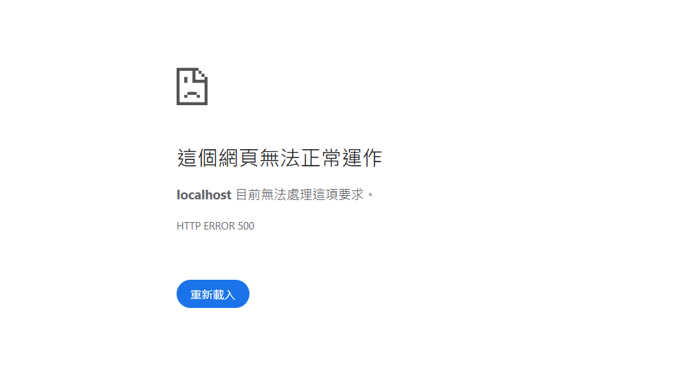
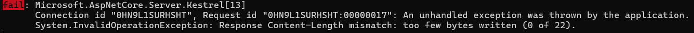

# ASP.NET Core MVC 串流檔案匯出 Troubleshooting

- 問題背景：在 ASP.NET Core MVC 可中使用 `FileStreamResult` 回傳檔案減少記憶體的消耗，但如果串流的位置不正確則可能會發生錯誤


- 實測後發生這個錯誤的請求沒有響應內容，也不被以下 Exception 機制捕獲：
  - DeveloperExceptionPage
  - Controller Action 中的 try-catch
  - 全域 Middleware 中的 try-catch

- 但是在 `ILogger` 則有輸出相關訊息，可以看出訊息指出回應的 Content-Length 不相符，實際寫入長度為 0


## 程式示意

- 註：`ControllerBase` 中的 `File` 會建構 `FileStreamResult`
```csharp
public IActionResult Download()
{
    var stream = ExportZip(); // 這個操作後 stream 位置在末端
    return File(stream, "application/zip", "example.zip");
}
```

## 修改方法

- 確保串流位置正確

```csharp
public IActionResult Download()
{
    var stream = ExportZip();
    stream.Position = 0;
    return File(stream, "application/zip", "example.zip");
}
```

## 範例

- 範例中使用 `FileStreamResult` 匯出文字檔也能重現此錯誤
- 範例：[ExampleController](ExampleController.cs)

## 參考
- [Microsoft](https://learn.microsoft.com/zh-tw/dotnet/api/system.web.mvc.filestreamresult?view=aspnet-mvc-5.2)