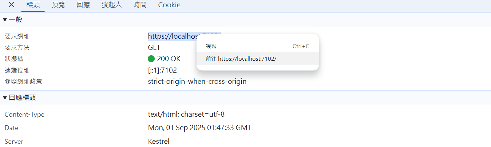
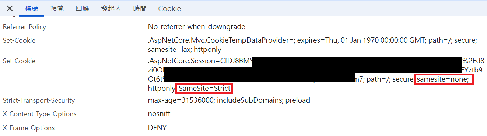

# ASP.NET Core Session Loss Troubleshooting

- 問題背景：ASP.NET Core 網站使用 Session 儲存使用者狀態，發現大部分狀況下使用正常，但特定操作後 Session 會遺失。在開發環境無法重現，僅在正式環境發生
- 網站沒有使用 Load Balancer，發生 Session 遺失前沒有重啟應用程式、也沒有登入超時，基本可以排除以上原因

## 已知導致 Session 遺失狀況

- 由特定第三方 OAuth 服務登入後
- 從其他外部網站連結進入該網站
- 使用 Chrome Developer Tool 的 "前往" 功能



## 初步推測原因

- Session ID 透過 Cookie 傳遞，Session 遺失可能是 Cookie 沒有被瀏覽器帶回，觀察 Chrome Developer Tool 發現 Cookie 內的 Session ID 確實發生了改變

## Cookie 屬性

- Response Header 中 Set-Cookie 的內容範例如下：

```
Set-Cookie: SessionId=abc123; Secure; HttpOnly; SameSite=Strict
```

| 屬性          | 主要用途                          | 限制/效果                                                                                             |
| ------------ | -------------------------------- | ---------------------------------------------------------------------------------------------------- |
| **Secure**   | 確保 Cookie 只會在 HTTPS 連線中傳送 | 瀏覽器不會在 HTTP 明文請求時附帶該 Cookie                                                                 |
| **HttpOnly** | 防止 JavaScript 存取              | JavaScript 無法讀取或修改該 Cookie，但仍會隨 HTTP 請求送出                                                 |
| **SameSite** | 限制 Cookie 在跨站請求中是否能送出   | `Strict`：僅同站請求帶上 Cookie<br> `Lax`：允許部分跨站（如 GET link/form submit）<br> `None`：允許跨站，但需搭配 `Secure` |


- Session 所使用的 Cookie 不會透過 JavaScript 存取，可以排除 `HttpOnly` 影響
- 正式環境有 HTTPS，初步可以排除 `Secure` 影響。但正式環境會套用 WAF，WAF 與 IIS 溝通可能走 HTTP 協定而非 HTTPS，可能導致被設定為 `Secure` 的 Cookie 無法傳送。這是一個可能原因，但應該不會只在特定操作後發生

## Response Set-Cookie 的怪異狀況

- 發現正式環境 Response Header 中的 Set-Cookie 出現了兩次 SameSite 的設定，其中一個是 "None"，另一個是 "Strict"，但是網站程式的設定只有 "None"，且開發環境網站啟動後，Set-Cookie 也只有一個 "SameSite=None"
- 故推測是 WAF 或 IIS 在某些狀況下會額外加上 "SameSite=Strict" 的設定



- 如果是 "SameSite=Strict" 的設定生效，那麼就符合了 `由特定第三方 OAuth 服務登入`、`從其他外部網站連結進入該網站` Session 遺失的狀況，因為這些都是跨站請求