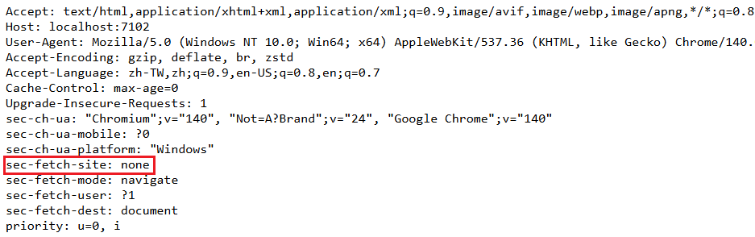
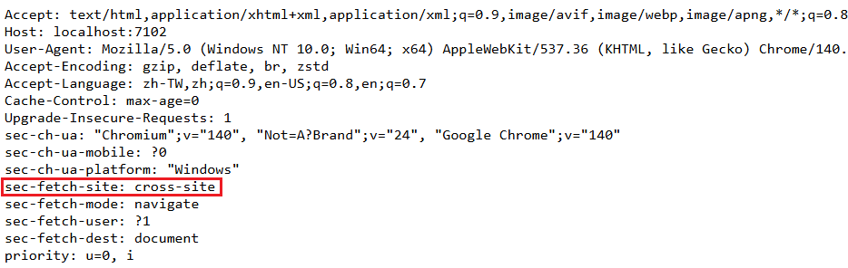

# ASP.NET Core Session Loss Troubleshooting

- 問題背景：ASP.NET Core 網站使用 Session 儲存使用者狀態，發現大部分狀況下使用正常，但特定操作後 Session 會遺失。在開發環境無法重現，僅在正式環境發生
- 網站沒有使用 Load Balancer，發生 Session 遺失前沒有重啟應用程式、也沒有登入超時，基本可以排除以上原因

## 已知導致 Session 遺失狀況

- 由特定第三方 OAuth 服務登入後
- 從其他外部網站連結進入該網站
- 使用 Chrome Developer Tool 的 "前往" 功能


## 初步推測原因

- Session ID 透過 Cookie 傳遞，Session 遺失可能是 Cookie 沒有被瀏覽器帶回，觀察 Chrome Developer Tool 發現 Cookie 內的 Session ID 確實發生了改變

## Cookie 屬性

- Response Header 中 Set-Cookie 的內容範例如下：

```
Set-Cookie: SessionId=abc123; Secure; HttpOnly; SameSite=Strict
```

| 屬性          | 主要用途                          | 限制/效果                                                                                             |
| ------------ | -------------------------------- | ---------------------------------------------------------------------------------------------------- |
| **Secure**   | 確保 Cookie 只會在 HTTPS 連線中傳送 | 瀏覽器不會在 HTTP 明文請求時附帶該 Cookie                                                                 |
| **HttpOnly** | 防止 JavaScript 存取              | JavaScript 無法讀取或修改該 Cookie，但仍會隨 HTTP 請求送出                                                 |
| **SameSite** | 限制 Cookie 在跨站請求中是否能送出   | `Strict`：僅同站請求帶上 Cookie<br> `Lax`：允許部分跨站（如 GET link/form submit）<br> `None`：允許跨站，但需搭配 `Secure` |


- Session 所使用的 Cookie 不會透過 JavaScript 存取，可以排除 `HttpOnly` 影響
- 正式環境有 HTTPS，初步可以排除 `Secure` 影響。但正式環境會套用 WAF，WAF 與 IIS 溝通可能走 HTTP 協定而非 HTTPS，可能導致被設定為 `Secure` 的 Cookie 無法傳送。這是一個可能原因，但應該不會只在特定操作後發生

> [!NOTE]  
> 如果是沒有 HTTPS 的測試環境出現 Session 遺失，可以先檢查 `Secure` 屬性，這是一個常見原因

## Response Set-Cookie 的怪異狀況

- 發現正式環境 Response Header 中的 Set-Cookie 出現了兩次 SameSite 的設定，其中一個是 "None"，另一個是 "Strict"，但是網站程式的設定只有 "None"，且開發環境網站啟動後，Set-Cookie 也只有一個 "SameSite=None"
- 故推測是 WAF 或 IIS 在某些狀況下會額外加上 "SameSite=Strict" 的設定


- 如果是 "SameSite=Strict" 的設定生效，那麼就符合了 `由特定第三方 OAuth 服務登入`、`從其他外部網站連結進入該網站` Session 遺失的狀況，因為這些都是跨站請求
- 這些問題也在 Cookie 的 "SameSite=Strict" 移除後解決了

## Chrome Developer Tool 的 "前往"

- 使用 Chrome Developer Tool 的 "前往" 功能也有 Session 遺失，這也算是一種跨站請求嗎? 一開始我並不確定這個操作方法發出的請求與一般使用者直接在網址列輸入網址的請求有什麼不同
- 因此在開發環境實現一個列出 Request Header 的小功能，並使用 "前往" 功能發出請求，觀察 Request Header 的差異

- 直接在網址列輸入網址的 Request Header


- 使用 "前往" 功能發出的 Request Header


- 可以發現兩者的差異在於 `Sec-Fetch-Site`，直接輸入網址的值是 `none`，而 "前往" 功能的值是 `cross-site`

## 如果必須使用 SameSite=Strict

- 以 ASP.NET Core 的 Cookie 驗證來說，通常會配置一個 LoginPath，當使用者沒有登入時會被導向該路徑進行登入

```csharp
services.ConfigureApplicationCookie(options =>
{
    options.LoginPath = "/Login";
});
```

- 此時會被導向 LoginPath 的狀況可能為：
  - 使用者沒有登入
  - 使用者有登入，瀏覽器已經有儲存 Cookie，但因請求沒有夾帶 Cookie（例如跨站進入）所以被判定為沒有登入

- 讓 LoginPath 方法接受一個 `returnUrl` 的參數，並且返回一個頁面，讓瀏覽器載入該頁面後再對傳入的 `returnUrl` 進行導向（例如使用 Javascript），由於這個請求在站內透過瀏覽器發起，因此可以帶上 Cookie，此時可能狀況：
  - 使用者沒有登入，導向 `returnUrl` 頁面後又會被導向回 LoginPath 形成迴圈，因此這邊需要特別處理導回 Login 頁面
  - 使用者有登入，導向 `returnUrl` 頁面後成功帶上 Cookie，回到原本要訪問的頁面

