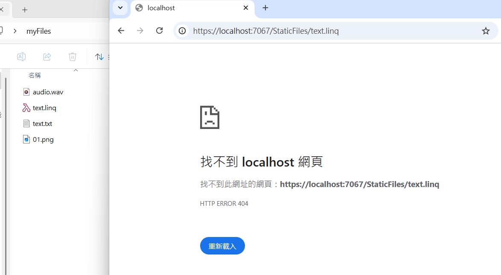
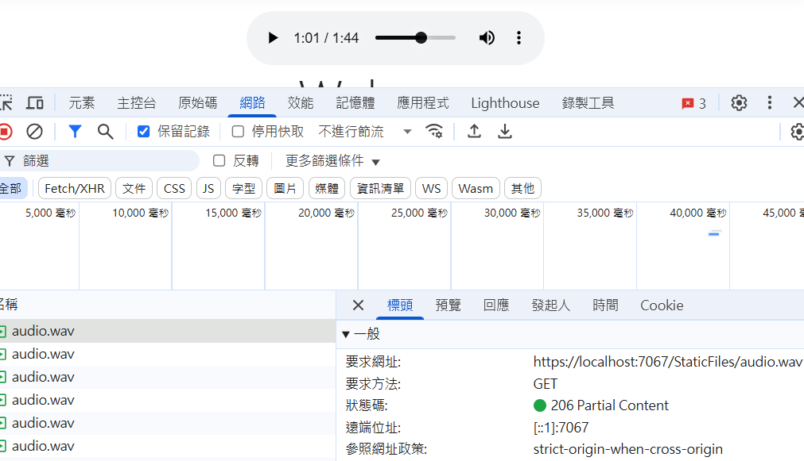

# ASP.NET Core UseStaticFiles

- `UseStaticFiles` 是 ASP.NET Core 中的一個 Middleware，用於服務靜態檔案。靜態檔案包括 HTML、CSS、JavaScript、影像等不需要伺服器端處理的檔案。UseStaticFiles 將這些檔案直接從檔案系統提供給客戶端

## 使用 UseStaticFiles
```csharp
app.UseStaticFiles(new StaticFileOptions
{
    FileProvider = new PhysicalFileProvider(@"C:\Users\user\Desktop\myFiles"),
    RequestPath = "/StaticFiles",
    ServeUnknownFileTypes = true,
    DefaultContentType = "application/octet-stream"
});
```

- FileProvider：設定靜態檔案的提供者，可以使用 PhysicalFileProvider
- RequestPath：設定靜態檔案的請求路徑前綴，如：設置為 /StaticFiles，則請求 /StaticFiles/filename 會對應到實際檔案系統中的檔案
- ServeUnknownFileTypes：是否允許服務未知檔案類型，預設為 false，設置為 true 時會服務所有檔案類型
- DefaultContentType：未知檔案類型的 MIME 類型預設值

> [!TIP]
> 如果 ServeUnknownFileTypes 設置為 false，則只有在 MIME 類型映射中設置的檔案類型才會被服務，其他檔案類型的請求會返回 404 錯誤
> 

> [!TIP]
> UseStaticFiles 是支援 206 Partial Content 的
> 