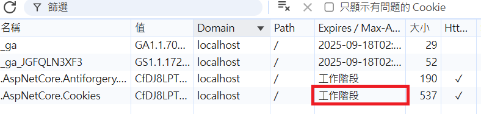
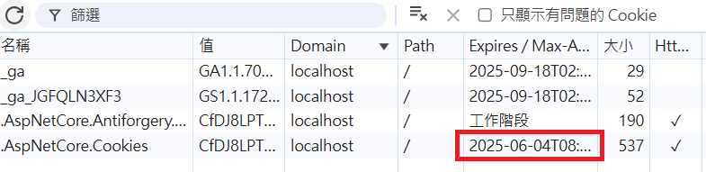
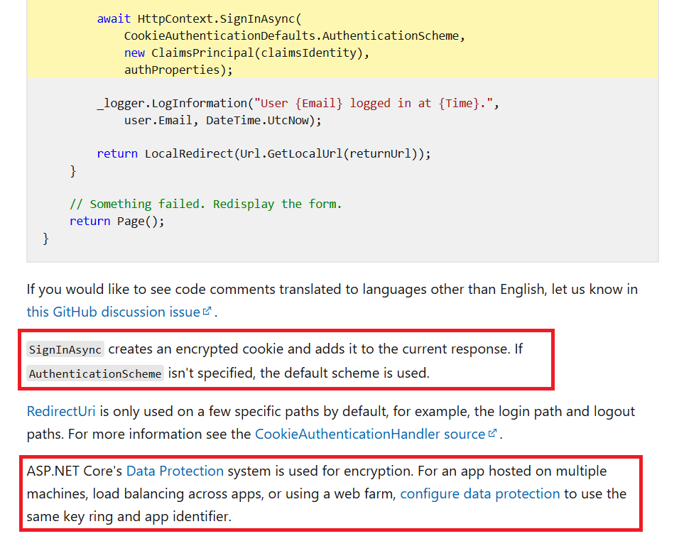
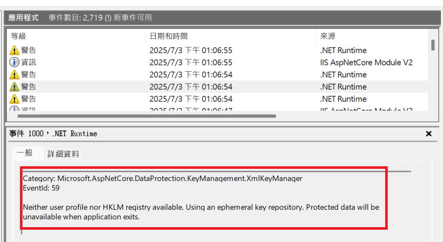
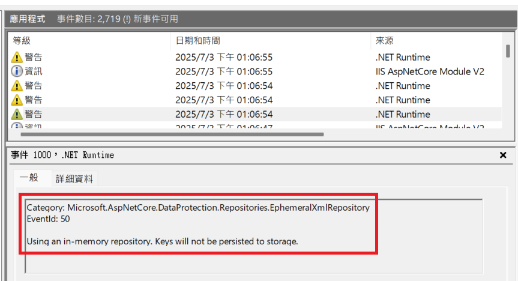

# ASP.NET Core 認證機制

## UseAuthentication vs UseAuthorization

- `UseAuthentication` 和 `UseAuthorization` 都屬於 ASP.NET Core 的 Middleware，用於處理認證和授權。
- 以往需要驗證與授權的應用程式需要呼叫 `app.UseAuthentication()` 與 `app.UseAuthorization()`，而在 ASP.NET Core 6.0 之後，`UseAuthentication` 預設會被自動啟用。

| 元件                        | 說明                                                         |
| ------------------------- | ---------------------------------------------------------- |
| `app.UseAuthentication()` | 驗證使用者身份，解析請求中的身份驗證資訊（如 Cookie 或 JWT），並建立 `HttpContext.User`。 |
| `app.UseAuthorization()`  | 檢查授權條件，根據 `[Authorize]` 的設定（如角色、政策），檢查 `HttpContext.User` 是否有權限。  |

> [!TIP]
> **認證(Authentication)**：驗證身份  
> **授權(Authorization)**：檢查權限

## 相關方法與 scheme 名稱

| 方法                                          | 參數用途                   | 說明                                                         |
| -------------------------------------------- | ------------------------- | ----------------------------------------------------------- |
| `AddAuthentication("XXX")`                   | **預設的認證方案名稱**       | 未指定 scheme 時，會使用這個名稱對應的方案（如 `[Authorize]`、`SignInAsync()`） |
| `AddCookie("YYY")`                           | **註冊 Cookie 認證方案名稱** | 註冊 Cookie 認證方案，並給定一個名稱                                 |
| `AddJwtBearer("ZZZ")`                        | **註冊 JWT 認證方案名稱**    | 註冊 JWT 認證方案，並給定一個名稱                                    |
| `SignInAsync("AAA")` / `SignOutAsync("AAA")` | **實際執行的認證方案名稱**    | 名稱需與已註冊的方案一致（例如 Cookie、JWT 方案）                      |

- 所有使用到的 scheme 名稱都必須出現在 AddCookie/AddJwtBearer (或是其他註冊方法) 註冊過才有效，否則執行時會出現錯誤如：`No sign-in authentication handler is registered for the scheme`


## Example

```csharp
services.AddAuthentication("CookieScheme") // 設定預設為 Cookie
    .AddCookie("CookieScheme")
    .AddJwtBearer("JwtScheme", options =>
    {
        options.TokenValidationParameters = new TokenValidationParameters
        {
            ValidateIssuer = true,
            ValidateAudience = true,
            ValidateLifetime = true,
            // ...
        };
    });
```

## ASP.NET Core Identity

- 如果使用 `AddIdentity` 方法，則會自動註冊驗證機制(Authentication)、授權機制(Authorization)、其他使用者與角色相關的服務(如 SignInManager、UserManager)，且為 Cookie 認證方案，並且預設名稱為 `Identity.Application`，此時就不需要再寫 `services.AddAuthentication` 與 `services.AddCookie`。
- 也可以再加上 `AddEntityFrameworkStores` 與 EFCore 資料庫整合；如果不使用 EFCore 整合，則需要自行實作使用者與角色的儲存如 `IUserStore`、`IRoleStore`

```csharp
services.AddIdentity<AspNetUser, AspNetRole>()
    .AddRoleManager<RoleManager<AspNetRole>>()
    .AddEntityFrameworkStores<DbContext>();
```

- EFCore 整合後，ASP.NET Core Identity 會使用 EFCore 的資料庫 context 來儲存使用者、角色及相關身份資料，並且會有 `GenerateClaimsAsync` 的預設實作來產生使用者的 Claims，通常會包含 UserId、UserName、Email、PhoneNumber、SecurityStamp，透過註冊的 `IUserStore<TUser>` 與 `IRoleStore<TRole>` 作為資料來源
- 如果需要自訂 Claims，可以透過將資料寫入 `IdentityUserClaim` 表格來實現，EFCore 的預設實作會讀取這個資料來源，這些 Claims 就會自動被加入到使用者的 Claims 中
- 也可以透過繼承 `UserClaimsPrincipalFactory<TUser, TRole>` 來實作自訂的 Claims 生成邏輯，範例：

```csharp
public class CustomClaimsPrincipalFactory : UserClaimsPrincipalFactory<ApplicationUser, IdentityRole>
{
    public CustUserClaimsPrincipalFactory(UserManager<AspNetUser> userManager, RoleManager<AspNetRole> roleManager, IOptions<IdentityOptions> optionsAccessor) : base(userManager, roleManager, optionsAccessor)
    {
    }
    
    protected override async Task<ClaimsIdentity> GenerateClaimsAsync(AspNetUser user)
    {
        var identity = await base.GenerateClaimsAsync(user);
        // Add custom claims here
        identity.AddClaim(new Claim("Department", user.Department ?? ""));
        return identity;
    }
}
```

## `[Authorize]` 屬性

- `[Authorize]` 也會使用 `AddAuthentication("這裡的值")` 所設定的 **預設認證方案**
- 依照此範例的情境，如果沒有指定 scheme 系統會嘗試使用 `"CookieScheme"` 來驗證，例如：

```csharp
[Authorize]
```

- 如果要讓 API 使用 JWT 驗證：

```csharp
[Authorize(AuthenticationSchemes = "JwtScheme")]
```

## AuthorizationHandler

- 客製化授權邏輯可以透過繼承 `AuthorizationHandler<TRequirement>` 來實作，其中 `TRequirement` 是實作自 `IAuthorizationRequirement` 的類別，用來表示一種授權「條件」或「規則」
- `Requirement` 類別通常不包含邏輯，而是攜帶判斷所需的資料，實際的授權邏輯則實作在對應的 `AuthorizationHandler` 中。

- 範例1：[AuthorizationHandler-Ex1](AuthorizationHandler-Ex1.cs)，透過 `IAuthorizationRequirement` 設置條件給 `AuthorizationHandler` 使用

- 範例2：[AuthorizationHandler-Ex2](AuthorizationHandler-Ex2.cs)，透過由其他服務(`roleFuncService`)提供的資料控制授權 

## Cookie 登入與登出

```csharp
await HttpContext.SignInAsync("CookieScheme", userPrincipal, new AuthenticationProperties
{
    IsPersistent = true,
    ExpiresUtc = DateTime.UtcNow.AddDays(14)
});

await HttpContext.SignOutAsync("CookieScheme");
```

- 如果沒有設置 `IsPersistent = true`，這將是一個 **Session Cookie**，會在瀏覽器關閉時自動刪除



- 設置 `IsPersistent = true` 之後，會在指定的 `ExpiresUtc` 時間到期之前存在，關掉瀏覽器再打開還是登入狀態



## Cookie 驗證的加密依賴

- Cookie 驗證會自動使用 ASP.NET Core 的 Data Protection API 來加密和解密 Cookie 中的驗證資訊，預設情況下 Key 存在記憶體中，重啟後會重新生成
- 這導致 Cookie 雖然是儲存在瀏覽器端，但因為重新生成的 Key 變更，現有的登入 Cookie 都會無法解密而無效，用戶被強制登出
- 如果需要跨多個應用程式或重啟後仍然有效，可以配置 Data Protection API 使用持久化存儲（如 SQL Server、Redis 等）
- Microsoft 參考：[在 ASP.NET Core 中使用 Cookie 驗證](https://learn.microsoft.com/en-us/aspnet/core/security/authentication/cookie?view=aspnetcore-8.0#cookie-policy-middleware)  



- 如果沒有設置持久化存儲，也可以在事件檢視器當中看到相關警告，說明應用程式找不到可用的持久性儲存位置，一旦應用程式結束或 IIS 重啟就會無法解密 Cookie




