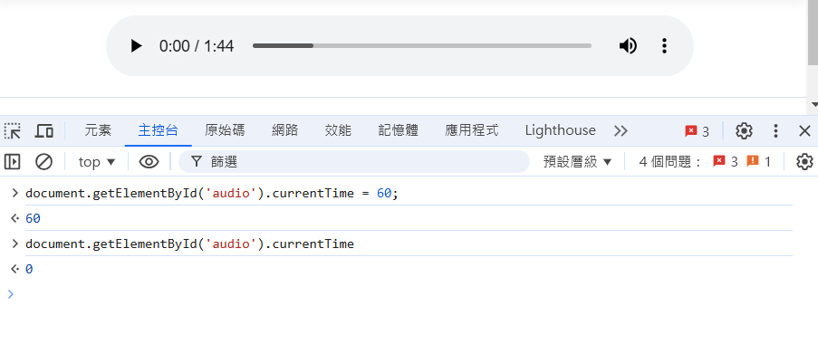
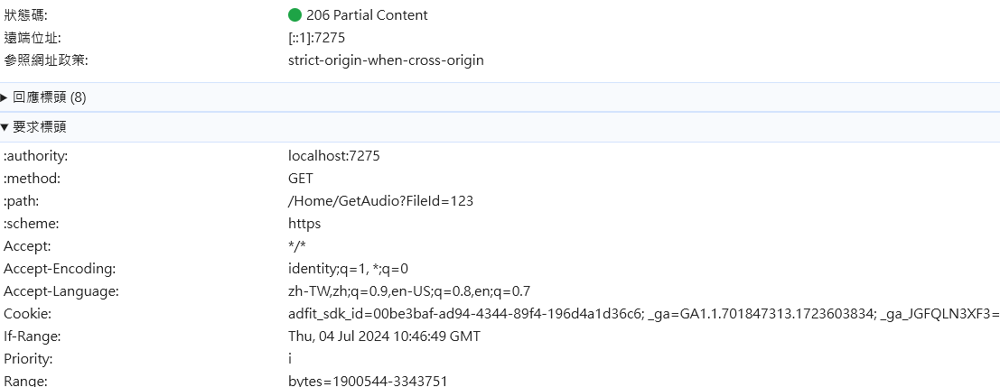
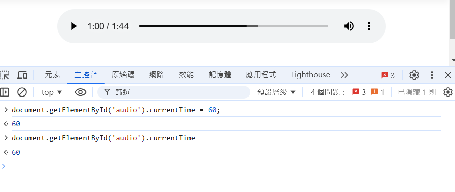

# Audio Seeking Troubleshooting

- 問題背景：某 .NET Core 網站有一個音檔播放頁面，在網頁中使用 JavaScript 設定 audio.currentTime 播放時間點後 currentTime 被重置為 0，無法跳轉到指定時間，或是透過 UI 點選 audio 時間也無法直接播放


## 處理過程

- 音訊檔案不放置於網站內部，須由資料庫讀出存放路徑
- 觀察 Network 發現當時的實作中 Server 回應 status code 為 200，而其他影音串流網站回應 status code 為 206

- Server 端 .NET Core 程式示意：
```csharp
public IActionResult GetAudio(long FileId)
{
    string physicalPath = GetPhysicalPath(FileId);
    return PhysicalFile(physicalPath, "application/octet-stream", "example.wav");
}
```

- 判斷可能是因為未正確回應 HTTP Range Requests，而導致 Audio Seeking 失效

- 將 Server 端 .NET Core 程式修改，將 enableRangeProcessing 參數設為 true 可支援 Range Requests 處理：
```csharp
public IActionResult GetAudio(long FileId)
{
    string physicalPath = GetPhysicalPath(FileId);
    return PhysicalFile(physicalPath, "application/octet-stream", "example.wav", true);
}
```
- 修改後回應 status code 為 206，可正常設定 currentTime

