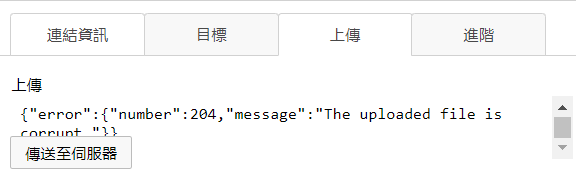
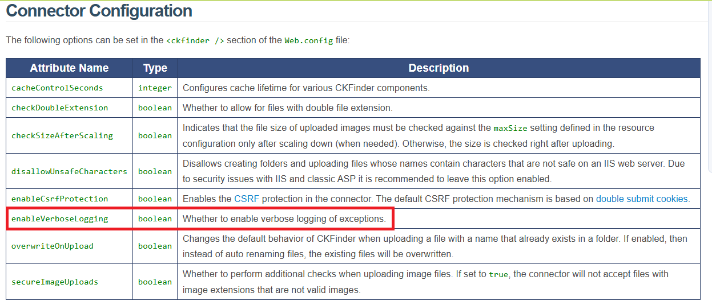
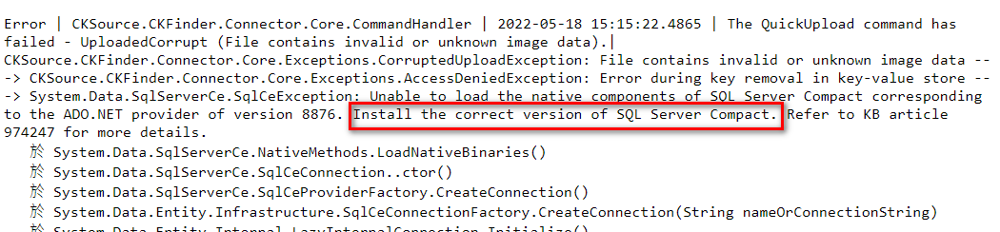

# C# Ckfinder Troubleshooting

- 問題背景：ASP.NET 系統移機後 CKEditor 上傳圖片時會顯示錯誤 `The uploaded file is corrupt`，並且沒有更多的相關錯誤訊息

## 處理過程

- 觀察該系統上傳功能後端使用了 Ckfinder

- 查看 [Ckfinder相關文件](https://ckeditor.com/docs/ckfinder/ckfinder3-net/debugging.html#debugging_log_file) 之後發現該系統沒有開啟 log 機制，先依照文件修改 config 開啟 log

- 再次上傳後可以看到 log 檔，原因是沒有安裝 SQL Server Compact，安裝後問題解決

