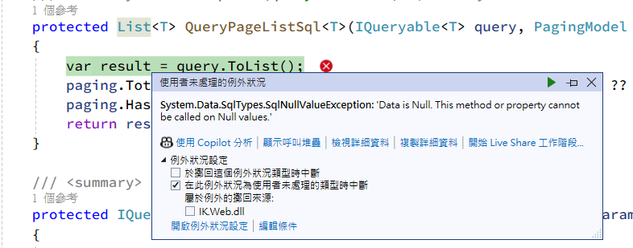
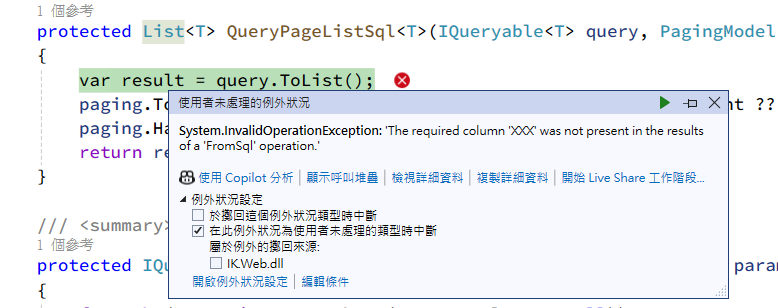

# C# EF Core Note

- EF Core 筆記
- Entity Framework Core (EF Core) 是 Microsoft 開發的 ORM 框架，用於 .NET 應用程式與資料庫之間的互動，有 Code First 和 Database First 兩種開發模式

## 欄位映射

- EF Core 欄位映射需明確 mapping，不會像 Dapper 一樣自動將沒有對應的欄位設為 C# 屬性的預設，如果使用 `SqlQueryRaw` 寫原生 sql 更要注意映射的實體類型

- 如果指定實體的欄位類型與查詢語法所得的資料類型不符會產生錯誤，例如實體的欄位為 `public string A { get; set; }`，如果查詢所取得的 A 欄位為 null 則會產生 `SqlNullValueException`


- 如果指定實體的欄位不存在於查詢語法中也會產生錯誤，例如實體的欄位為 `public string? XXX { get; set; }`，查詢語法也需要有對應的結果  


## Dapper 並用 Connection 與 Transaction

- 在 EF Core 可用 `DbContext.Database.GetDbConnection()` 取得目前 DbContext 使用的資料庫連線，此連線可以用於其他資料庫操作如使用 Dapper 進行查詢
- 如果連線是透過 EF Core 預設行為取得的(沒有自己 `connection.Open()` 或是使用外部連線)，則不需要手動開啟或關閉連線，EF Core 會自動處理，也不需要加上 `using` 或是 `Dispose`
- 在 EF Core 可用 `DbContext.Database.BeginTransaction()` 啟用交易，此時可透過 `Database.CurrentTransaction?.GetDbTransaction()` 取得目前交易，如此可將 Dapper 的執行也納入交易中
- Example: [BaseDataAccess.cs](BaseDataAccess.cs)

## 變更追蹤機制與 SaveChanges

- EF Core 具有變更追蹤機制，從資料庫載入實體後，EF Core 會自動追蹤這些實體的狀態變化，例如 `dbContext.XXXEntities.Add(entity)`、`dbContext.XXXEntities.Update(entity)`、`dbContext.XXXEntities.Remove(entity)` 等方法
- 這些變更會被暫存在記憶體中，直到呼叫 `SaveChanges()` 方法時，EF Core 才會生成 SQL 語句真正執行對資料庫的操作，此時 EF Core 會自動建立一個 transaction 包住當前的所有「有追蹤的資料庫異動」
- 如果查詢時使用了 `AsNoTracking()`，則 EF Core 不會追蹤這些實體的狀態變化，也不會在呼叫 `SaveChanges()` 時產生 SQL 語句，對於只查詢不需要追蹤修改的情況下，可以使用 `AsNoTracking()` 減少記憶體使用

## Migrations

- EF Core 的 Migration 是用來管理資料庫結構變更的工具，透過將資料模型（Code First）與資料庫結構的差異轉換成可追蹤的版本記錄

### 版本控制概念

- 每個 Migration 檔案都是一次資料庫結構變更的版本記錄，會按照建立順序套用
- EF Core 會在資料庫建立一個 __EFMigrationsHistory 系統表，用來記錄已套用的 Migration

### 指令

- 新增 Migration: 修改了資料模型(新增、刪除或修改資料表、欄位等)之後使用，會在專案中生成一個新的 Migration 檔案，裡面包含了這次變更的描述
- 套用 Migration: 根據 Migration 檔案中的指令更新資料庫結構

### 自行調整 Migration

- 可以手動編輯 Migration 檔案中的 Up() 和 Down() 方法，以自訂資料庫結構變更的邏輯
- 以下範例展示了修改 AspNetUserTokens 資料表中的欄位長度，因為變更的欄位包含主鍵，EF Core Migration 生成的 SQL 在執行時可能會遇到問題，因此手動調整 Migration 內容先移除主鍵待變更完成再重新建立：

```csharp
protected override void Up(MigrationBuilder migrationBuilder)
{
    // 移除主鍵 (手動調整)
    migrationBuilder.DropPrimaryKey(name: "PK_AspNetUserTokens", table: "AspNetUserTokens");

    // 調整欄位長度
    migrationBuilder.AlterColumn<string>(
        name: "Value",
        table: "AspNetUserTokens",
        type: "nvarchar(100)",
        maxLength: 100,
        nullable: true,
        oldClrType: typeof(string),
        oldType: "nvarchar(max)",
        oldNullable: true);

    migrationBuilder.AlterColumn<string>(
        name: "Name",
        table: "AspNetUserTokens",
        type: "nvarchar(50)",
        maxLength: 50,
        nullable: false,
        oldClrType: typeof(string),
        oldType: "nvarchar(450)");

    migrationBuilder.AlterColumn<string>(
        name: "LoginProvider",
        table: "AspNetUserTokens",
        type: "nvarchar(50)",
        maxLength: 50,
        nullable: false,
        oldClrType: typeof(string),
        oldType: "nvarchar(450)");

    // 重新建立主鍵 (手動調整)
    migrationBuilder.AddPrimaryKey(
        name: "PK_AspNetUserTokens",
        table: "AspNetUserTokens",
        columns: new[] { "UserId", "LoginProvider", "Name" });
}
```