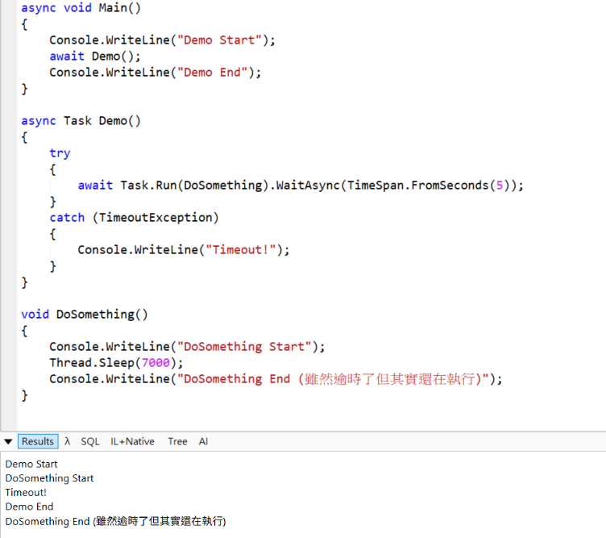

# C# 同步方法逾時機制

- 如果只是要單純地給同步方法加上逾時機制，可以使用 `Task.Run` + `WaitAsync(TimeSpan)` 實作：[範例Demo](Demo.linq)

```csharp
await Task.Run(DoSomething).WaitAsync(TimeSpan.FromSeconds(5));
```

- 但需要注意的是此作法僅代表 **呼叫端在逾時後放棄等待**(透過在逾時的時候拋出 Exception 的機制實現)，並不會實際中斷同步方法的執行；同步方法仍可能在背景執行直到完成



## 同步方法取消

- 如果需要真正中斷同步方法的執行，則需要在同步方法內部自行實作取消邏輯並傳入 `CancellationToken` 使用：
```csharp
void SyncMethod(CancellationToken token)
{
    DoWork1();
    token.ThrowIfCancellationRequested(); 
    DoWork2();
    token.ThrowIfCancellationRequested(); 
    DoWork3();
    token.ThrowIfCancellationRequested(); 
}
```