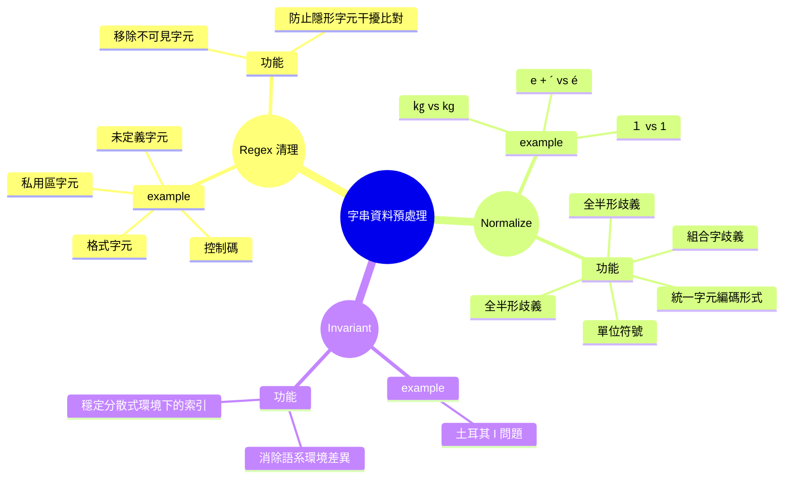

# C# 字串資料預處理



## Regex 清理
- 有時在處理資料時會遇到一些奇怪的字元導致處理異常，檢查後發現多是控制字元，因此想在前處理時將其移除
- 但其實正規式中的 `\p{C}`（Other 其他字元）包含多個子分類。而 C# 中 `char.IsControl` 方法對應的僅是 `\p{Cc}` 類別，若直接過濾大類 `\p{C}`，可能會誤殺一些後續處理上需要保留的編碼，因此依子分類處理

### 1. \p{Cc} 控制字元

- 基本控制字元：U+0000 至 U+001F（C0 控制字元，如 Tab, LF, CR 等）
- DELETE：U+007F
- 擴充控制字元：U+0080 至 U+009F（C1 控制字元）

### 2. \p{Cf} 格式字元

- 零寬度字元（不會顯示但會影響排版）
- 文字方向控制字元
- 常見格式字元：
  - ZWSP（Zero Width Space，零寬空格）：U+200B
  - ZWNJ（Zero Width Non-Joiner）：U+200C
  - ZWJ（Zero Width Joiner）：U+200D
  - LRM（Left-to-Right Mark）：U+200E
  - RLM（Right-to-Left Mark）：U+200F
  - BOM（Byte Order Mark，位元組順序記號）：U+FEFF（讀取特定文字檔時易遇到，常造成不可見的字串比對失敗）
  - SHY（Soft Hyphen，軟性連字號）：U+00AD（網頁排版用，複製內容時偶爾會夾帶）

### 3. \p{Cn} 未分配字碼

- Unicode 標準中尚未定義的字碼位置

### 4. \p{Co} 私人使用區

- 讓使用者或軟體公司自己定義用途的區域（PUA，常用於自訂圖示字型）

### 5. \p{Cs} 代理對字碼

- **範圍為 U+D800 至 U+DFFF**
- 用途是編碼 Unicode 第 1 平面以上的字元（U+10000 之後的字元）
- 為 UTF-16 編碼保留。必須兩兩成對（High + Low Surrogate）才能表示更大範圍的特定字元，例如：**emoji 表情符號、部分 CJK 擴展區漢字**。單獨出現時沒有實質意義。

---

## 依據資料性質使用方法

若想清除所有（常見）不具實質內容的控制與格式字元：

```csharp
// 這個過濾方法不將 \p{Cs} 加入，避免破壞字串中的 Emoji 符號或罕見中文字
Regex.Replace(input, @"[\p{Cc}\p{Cf}\p{Cn}\p{Co}]", "");
```

> [!NOTE]  
> 雖然 `\p{Z}` 系列（如 `\p{Zp}` 段落分隔 U+2029、`\p{Zl}` 行分隔 U+2028）不屬於 `\p{C}` 控制大類，但若資料清理目標是包含「不可見的干擾排版字元」，實務上也可視情況一併處理。

---

## 字串大小寫轉換 (ToLower / ToLowerInvariant)

在 C# 中，如果直接使用 `.ToLower()` 或 `.ToUpper()`，預設會依照**當前執行緒的語系文化 (Current Culture)** 進行轉換。這在某些語系下會產生非預期的結果：

- 範例 Turkish-I Problem：
  在土耳其語系（`tr-TR`）中，大寫的英文 `I` 轉小寫會變成無點的 `ı`（U+0131），而不是一般英文預期的 `i`（U+0069）

### 何時使用

當需要統一文字大小寫，且**不是顯示給使用者的本地化內容**，例如：
- 程式邏輯判斷
- 後端辨識碼轉換（如：用以產生 JWT 或是 Cache Key）
- 建立不區分大小寫的雜湊

建議使用 `ToLowerInvariant()` 或 `ToUpperInvariant()`，會使用 .NET 內建的 Invariant Culture（固定文化規則）

> [!NOTE]  
> 尤其在分散式系統中更為重要，因為不同伺服器的語系可能不同。


### IgnoreCase 字串比對

1. `CurrentCultureIgnoreCase`：當前執行緒的語系文化
2. `InvariantCultureIgnoreCase`：會使用固定文化規則
3. `OrdinalIgnoreCase`：直接比較字元的二進位數值，忽略語言文化規則，此時大小寫判斷是基於 Unicode 規範的轉換

```csharp
// 若是為了單純判斷相等，直接使用 StringComparison 效能更好（不產生額外字串配置）
if (string.Equals(input, "admin", StringComparison.OrdinalIgnoreCase)) {

}
```

 `InvariantCulture` 仍帶有語言語義知識（檢查字元組合）；`Ordinal` 是純粹的數值轉換（查表 -> 比對），效能又更好
```csharp
string s1 = "å";
string s2 = "a\u030A";
string.Equals(s1, s2, StringComparison.InvariantCultureIgnoreCase)  // True
string.Equals(s1, s2, StringComparison.OrdinalIgnoreCase)  // False
```

---

## Unicode 字串正規化 (String.Normalize)

另一個常見的字串預處理陷阱是**相同視覺字元卻有不同的 Unicode 編碼組合**。
例如，帶有重音符號的字母（如 `é`）有兩種常見的 Unicode 表示方式：
1. **單一合成字元 (Precomposed)**：直接使用單一字元 `é` (U+00E9)
2. **組合字元 (Combining)**：使用基本字母 `e` (U+0065) 加上組合重音符號 `´` (U+0301)

如果直接比對這兩種表示法的字串，即使視覺上完全相同，C# 程式也會判定為不相等（`==` 回傳 false），這在系統比對、搜尋或主鍵驗證時經常造成難以發現的問題。

### Normalize 方法與正規化型式

為了確保字串的一致性，可以使用 `String.Normalize()` 將字串轉換為明確定義的標準形式：

- Form C (NFC, 預設)：規範相符合成 (Canonical Composition)。盡可能將組合字元合併為單一字元。這也是多數系統、網頁的標準建議表示法。
- Form D (NFD)：規範相符分解 (Canonical Decomposition)。將字元拆解為基本字母與組合標記。
- Form KC (NFKC) 與 Form KD (NFKD)：除了分解/合成外，還包含**相容性轉換 (Compatibility)**。會將視覺或語義相似的字元正規化，例如將全形字母轉為半形、上標/下標數字轉為一般數字、或是將 `①`、羅馬數字 `Ⅳ` 拆解轉換為標準對應字元。

> [!NOTE]  
> 預設的 `String.Normalize()` 採用 Form C，可以想像成將「組合字」壓扁成「單一字元」

```csharp
string s1 = "\u00E9";   // 'é' (Form C 格式)
string s2 = "e\u0301";  // 'e' + '´' (Form D 格式)

Console.WriteLine(s1 == s2); // False
string normalizedS2 = s2.Normalize(NormalizationForm.FormC);
Console.WriteLine(s1 == normalizedS2); // True
```

在我近期的專案中有使用 `NormalizationForm.FormKC` 來處理使用者輸入的地址資料，主要目的是將門牌號資訊中的全形字元轉為半形，以減少後續發送給第三方 API 時可能造成的問題。
