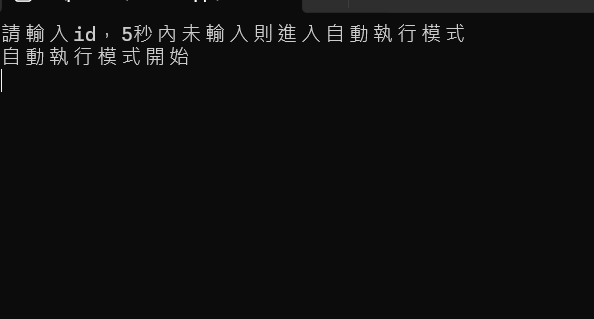

# C# 逾時機制的 ConsoleReadLine

- 此 C# ConsoleApp 提供逾時機制的 ConsoleReadLine [範例](Program.cs)，但是也存在一些問題

## `Console.In.ReadLineAsync()` 特性
- 該方法實際上**不會**真正取消輸入作業
- 一旦開始輸入，會阻塞當前執行緒

## 方法差異
- `ReadLineAsync()` 方法：
  - 開始輸入前因為還沒執行 `Console.In.ReadLineAsync()`，可以真正取消
  - 開始輸入後就會等待輸入完畢，程式才會繼續執行

- `ReadLineAutoResetEvent()` 方法：
  - 如果超過逾時時間，程式會繼續執行，但 `Console.In.ReadLineAsync()` 卻仍在等待使用者輸入
  - 如果後續還有其他 ConsoleReadLine 可能導致混淆