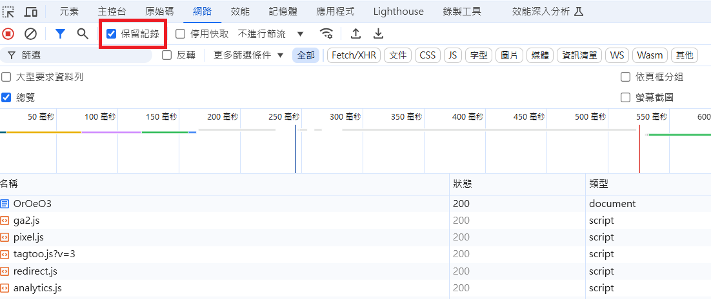
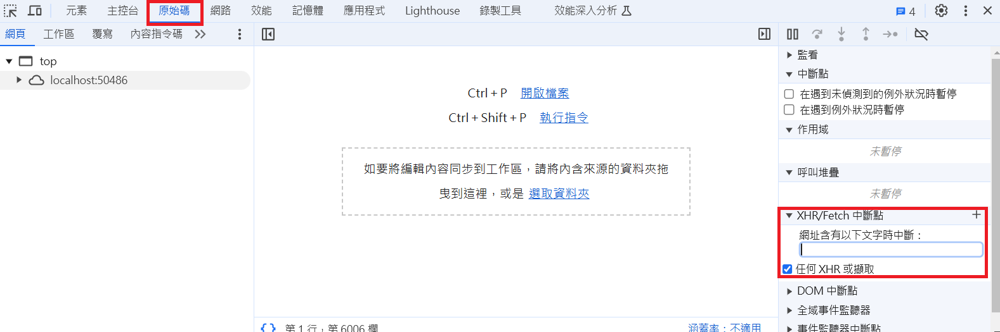

# ChromeDevTool Note

- ChromeDevTool 使用筆記

## 1.保留紀錄

- 可用於快速檢查網站 OAuth 或是登入後重新定向請求狀況
- 勾選 **保留紀錄 (Preserve Log)**，使用 reurl 網址測試後可看到重新定向前的紀錄被保留

## 2.XHR/Fetch 中斷點
- 可用於攔截所有或特定的 API 請求
- 於 **原始碼** 頁籤右方 **XHR/Fetch 中斷點** 區塊勾選
