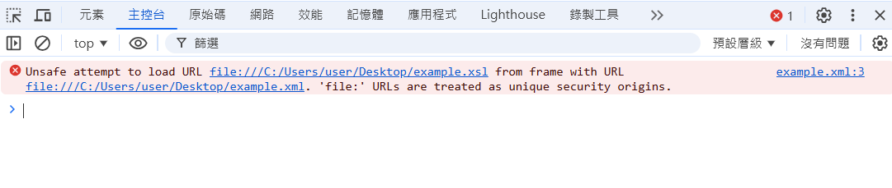

# Chrome 開啟本地 XML 與 XSL

- Chrome 基於安全性考量預設會阻擋本地 XML 檔案載入 XSL


## 解決方案

1. 使用本地伺服器，如：Visual Studio Code self hosting

2. Chrome 啟動參數設定（將以下指令的 chrome.exe 路徑改為自己 Chrome 的安裝位置）

```cmd
"C:\Program Files\Google\Chrome\Application\chrome.exe" --allow-file-access-from-files
```