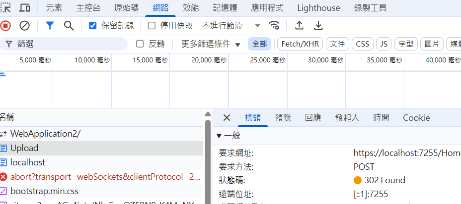

# ChromeDevTool Note

- ChromeDevTool 使用筆記

## 1.保留紀錄

- 可用於快速檢查網站 OAuth 或是登入後重新定向請求狀況
- 勾選 **保留紀錄 (Preserve Log)**，使用 reurl 網址測試後可看到重新定向前的紀錄被保留

## 2.XHR/Fetch 中斷點
- 可用於攔截所有或特定的 API 請求
- 於 **原始碼** 頁籤右方 **XHR/Fetch 中斷點** 區塊勾選

## 3.複製 HTML 元素路徑結構
- 可用於爬蟲、資料採集、自動化測試等情境，協助快速取得指定 HTML 元素路徑結構
- 在偵錯工具的元素分頁對 HTML 元素點選右鍵複製，右方子選單可選取類型：
  - XPATH 如：`//*[@id="readme"]/div[2]/article/div[3]`
  - Selector 如：`#readme > div.Box-sc-g0xbh4-0.QkQOb.js-snippet-clipboard-copy-unpositioned.undefined > article > div:nth-child(5)`  

## 4.尋找 HTML 元素
- 在偵錯工具的元素分頁 `(ctrl + f)` 開啟搜尋框，可使用 XPATH 或是 Selector 搜尋

## 5.上傳檔案 redirect 偵錯
- 上傳檔案的請求如果回應 redirect 重新定向，偵錯工具的 Network 面板可能無法顯示原始請求的 payload 資訊。如果是開發階段可暫時移除重新定向邏輯以方便偵錯

- 沒有選取檔案的請求可以顯示 payload 資訊

- 選取了檔案的請求未顯示 payload 資訊

# 6.覆寫內容

- 可用於修改網頁內容、測試不同的樣式或功能
