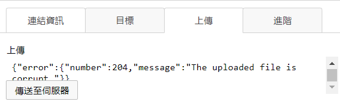
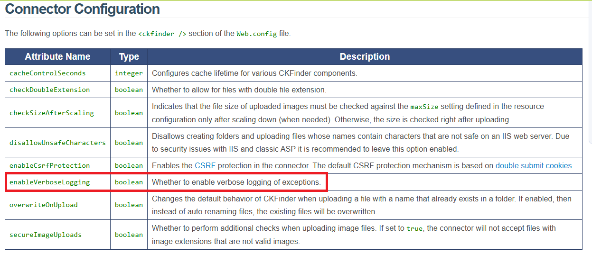
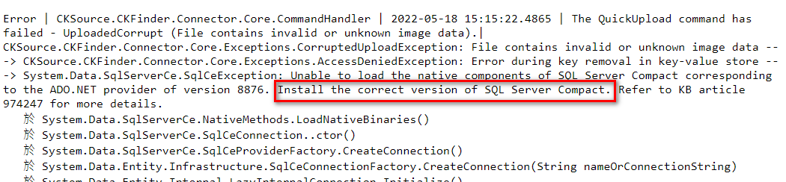

# Ckfinder Troubleshooting

- 問題背景:某系統移機後CKEditor上傳圖片時會顯示錯誤，並且沒有更多的相關錯誤訊息

## 截圖

- 錯誤訊息

- 觀察該系統上傳功能後端使用了Ckfinder

- 查看[相關文件](https://ckeditor.com/docs/ckfinder/ckfinder3-net/debugging.html#debugging_log_file) 之後發現該系統沒有開啟log機制，先依照文件修改config開啟log

- 再次上傳後可以看到log檔，原因是沒有安裝SQL Server Compact
