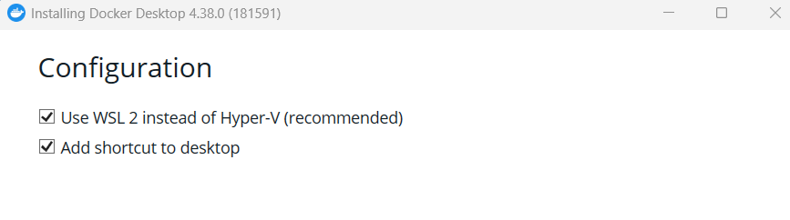
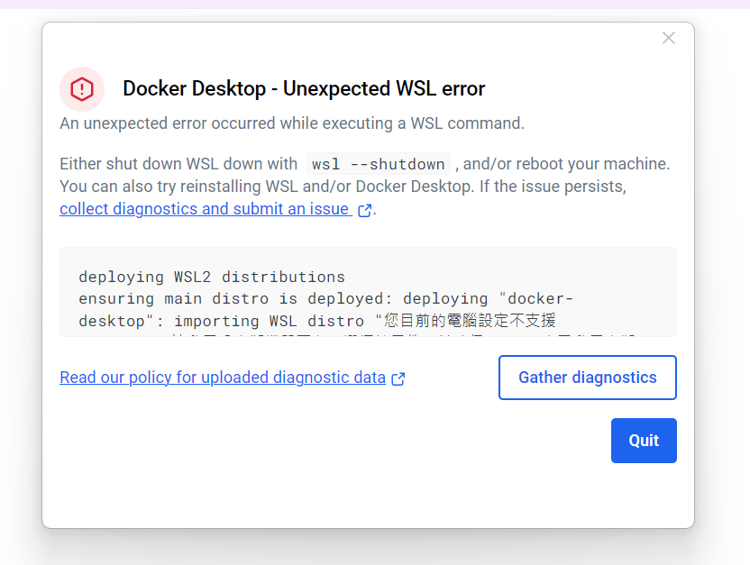
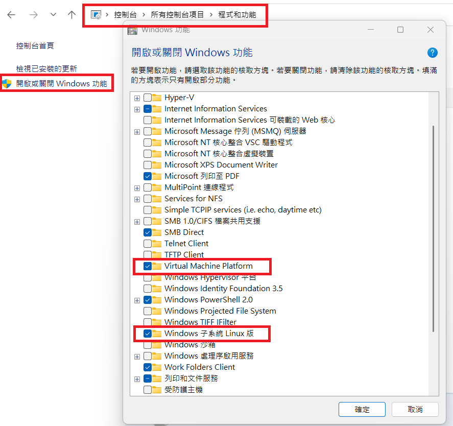
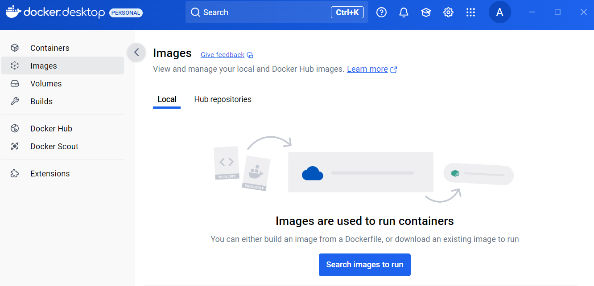
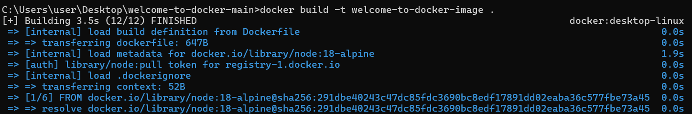
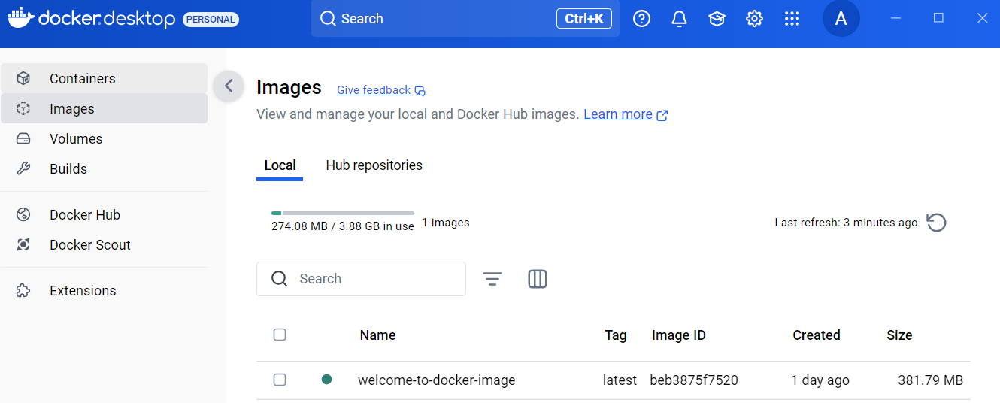
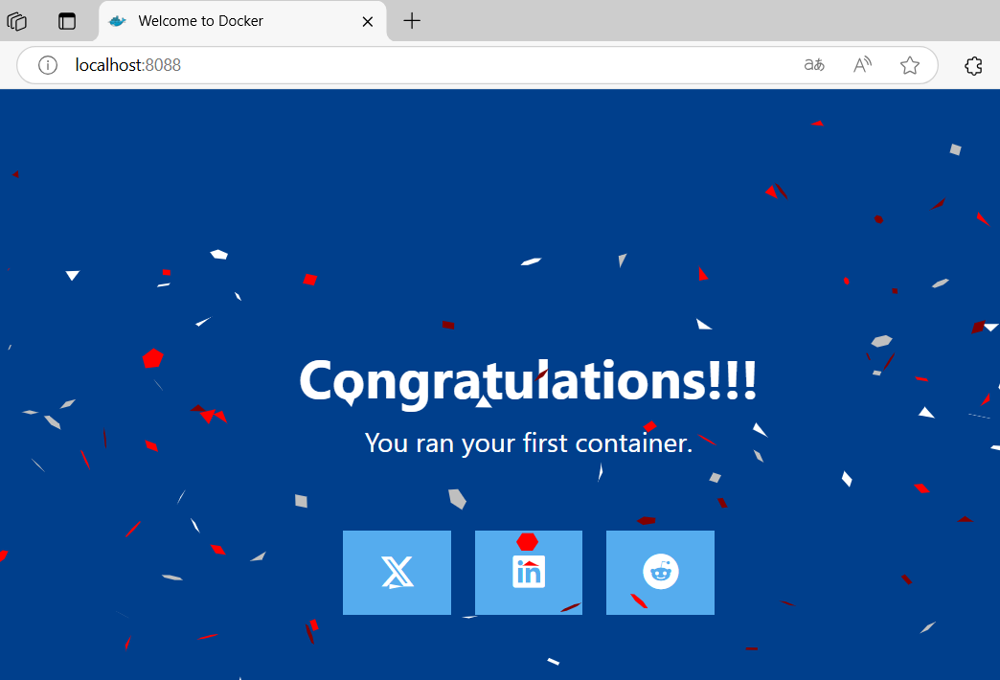
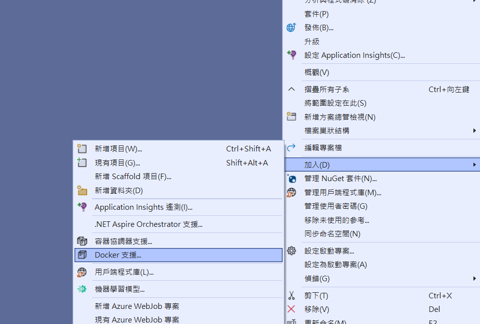
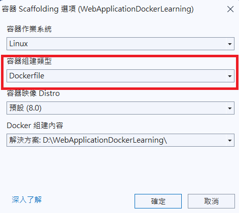
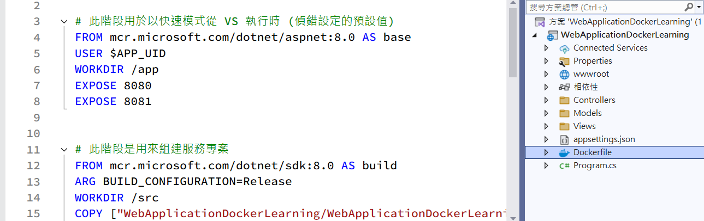

# Docker Learning Note

## Docker Desktop on Windows

- Docker 是需要一個 Linux 內核來運行的，在 Windows 上使用 Docker，一般是通過以下方式之一來提供 Linux 內核：
  - WSL2 (Windows Subsystem for Linux 2)，這是目前推薦的方式，效能較好
  - Hyper-V 虛擬化，在早期 Docker for Windows 版本中使用

- 安裝 Docker 時會出現選取選項 (目前已預設勾選 WSL2)：


- 這兩個方式都需要在 BIOS 中開啟 CPU 虛擬化功能 (Intel VT)，否則啟動時會出現錯誤：


- WSL2 需要開啟 **Windows 功能** 中的 **Virtual Machine Platform** 與 **Windows Subsystem for Linux**：


## welcome-to-docker 範例

- 在 [Docker Github](https://github.com/docker/welcome-to-docker) 下載範例 repository `welcome-to-docker`

- 啟動 Docker Desktop，因為是首次使用目前沒有任何的 image


- 到 `welcome-to-docker` 存放目錄下輸入指令：
```
docker build -t welcome-to-docker-image .
docker run -d -p 8088:3000 --name welcome-to-docker-container welcome-to-docker-image
```



- `docker build -t welcome-to-docker-image .` 指令說明：
  - `docker build`：告訴 Docker 讀取 Dockerfile 建立一個新的 image
  - `-t`：使用 `-t` 參數來指定 image 名稱為 welcome-to-docker-image
  - `-f`：使用 `-f` 指定讀取的 Dockerfile 檔，此處沒有指定故預設讀取 Dockerfile
  - `.`：表示**context(建置上下文)**，建置過程可以引用 context 中的任何檔案，所使用到的 `COPY` 指令也是基於此 context

- `docker run -d -p 8088:3000 --name welcome-to-docker-container welcome-to-docker-image` 指令說明：
  - `docker run`：告訴 Docker 建立並啟動一個新的容器
  - `-d`：detach 模式，讓容器在背景執行，而不會佔用當前的終端機
  - `-p 8088:3000`：port 對應，在瀏覽器中訪問 `http://localhost:8088`，實際上是透過 8088 port 訪問容器內的 3000 port
  - `--name welcome-to-docker-container`：指定容器名稱
  - `welcome-to-docker-image`：指定用此 image 來建立容器
  
- image 建立後可以在 Docker Desktop 看到建立的 image


- 容器啟動後可以使用瀏覽器開啟 `http://localhost:8088` 看到頁面


## Visual Studio Docker 支援

- 對專案點選右鍵，加入 > Docker 支援



- 確認後可產生 Dockerfile 檔案
