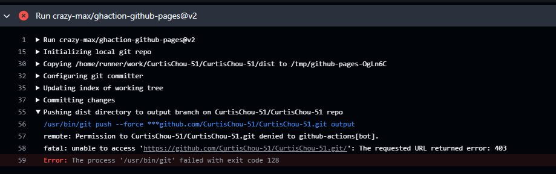
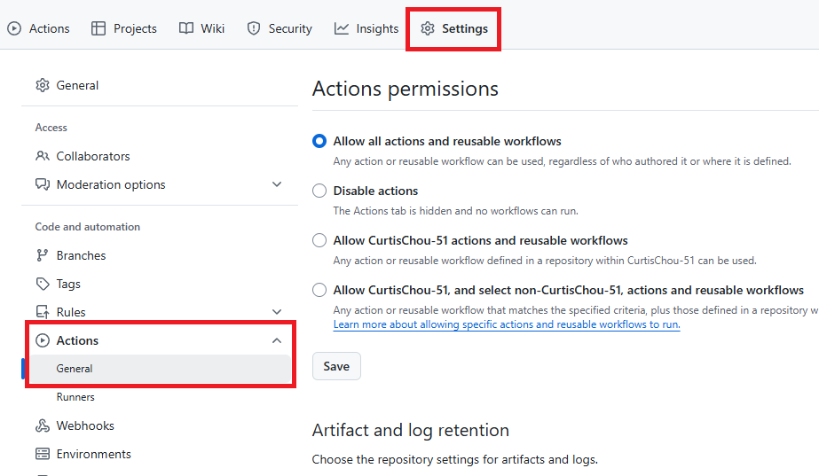
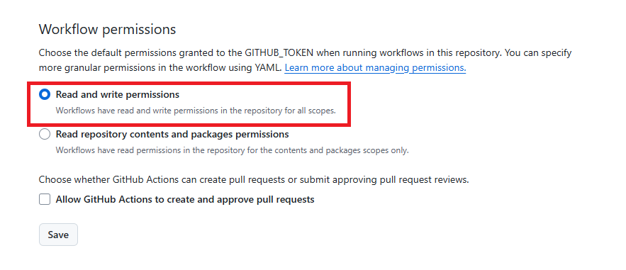

# Github Action Note

## Workflow

- Workflow 是一個自動化流程，由一個或多個 Job 組成，定義在 .github/workflows/ 目錄下的 `.yml` 或 `.yaml` 檔案中

### My First Github Workflow
- [main.yml](https://github.com/CurtisChou-51/CurtisChou-51/blob/main/.github/workflows/main.yml)
- 錯誤排除：

### Reference
- [About workflows](https://docs.github.com/en/actions/learn-github-actions/introduction-to-github-actions#about-workflows)
- [Workflow syntax for GitHub Actions](https://docs.github.com/en/actions/reference/workflow-syntax-for-github-actions)
