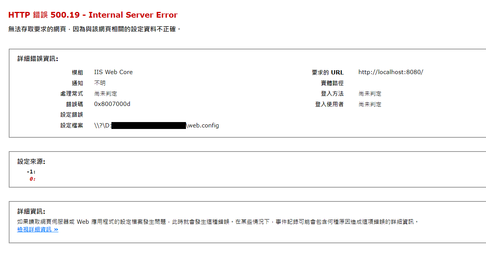
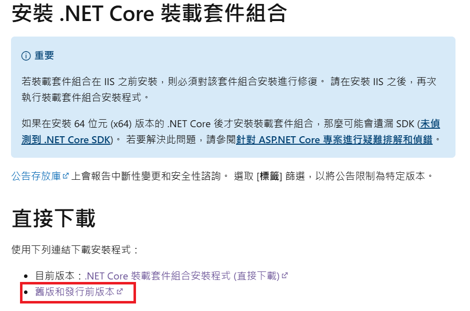
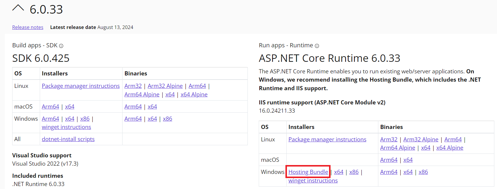

# IIS 500.19 部署錯誤處理

- 問題背景：.NET Core 網站部屬到 IIS 上之後出現 500.19 0x8007000d 錯誤

## 錯誤訊息

## 處理過程
1. 查詢資料後可能原因為未安裝 Hosting Bundle

2. 下載並安裝 .NET Core Hosting Bundle
   - 從 [Microsoft官方網站](https://learn.microsoft.com/zh-tw/aspnet/core/host-and-deploy/iis/hosting-bundle?view=aspnetcore-6.0) 下載
   
   

3. 安裝確認
   - 可在控制台中確認安裝狀態
   

## 參考資料
- [1](https://stackoverflow.com/questions/13532447/http-error-500-19-iis-7-5-error-0x8007000d)
- [2](https://blog.darkthread.net/blog/aspnetcore-500-19-0x8007000d/)
- [3](https://huier23.medium.com/net-%E6%96%B0%E6%89%8B%E6%9D%91-%E6%89%93%E4%BB%80%E9%BA%BC%E6%89%93-%E8%A6%81%E6%89%93%E5%8E%BB%E7%B7%B4%E8%88%9E%E5%AE%A4%E6%89%93-6da64ae1d61a)

