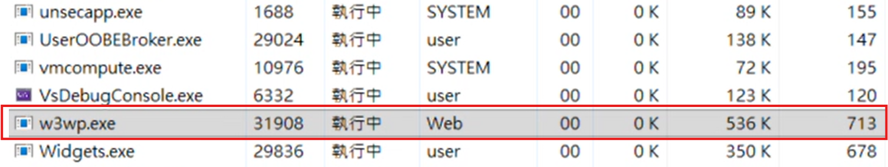
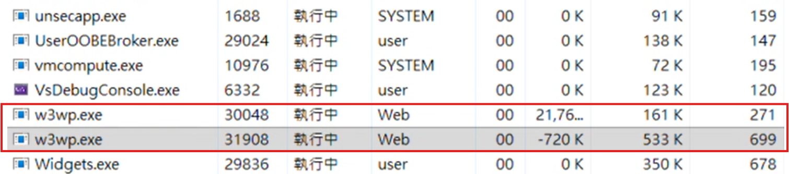
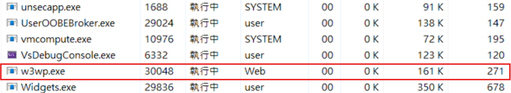

# IIS ASP .NET Core 更版筆記

- 以往更新 IIS 上的 ASP .NET 網站時多是停止站台；有時則是停止應用程式集區，近期才發現 ASP.NET Core 可以透過 [app_offline.htm](https://learn.microsoft.com/zh-tw/aspnet/core/host-and-deploy/app-offline?view=aspnetcore-8.0) 的方式來停止網站程式

> [!NOTE]  
> ASP.NET Core 在 IIS In-Process 模式下不支援多個應用程式共用同一個應用程式集區，一般也不建議應用程式集區共用，以下都基於單一應用程式集區

- 原理是由一個 IIS 模組：[ASP.NET Core Module (ANCM) for IIS](https://learn.microsoft.com/zh-tw/aspnet/core/host-and-deploy/aspnet-core-module?view=aspnetcore-8.0) 監控應用程式根目錄，發現 `app_offline.htm` 時就會停止應用程式，直到 `app_offline.htm` 移除後的下一個請求才會重新啟動應用程式

## IIS 執行角色簡介

- **站台**
  - 用來管理網站的請求，將請求導向對應的 Application
  - 定義對外存取方式，如 Port、Host Name、HTTPS 憑證

- **應用程式集區 (Application Pool)**
  - 建立與管理 `w3wp.exe`
  - 定義執行環境如 .NET Runtime

- **w3wp.exe**
  - IIS 上實際執行程式碼的 Process，真正負責執行應用程式
  - 載入 ASP.NET Core Runtime、應用程式 DLL

- **ASP.NET Core (應用程式本體)**
  - 依 Hosting Model 不同，可能直接或間接在 `w3wp.exe` 中執行

## 不同停止方式

### 停止站台
- 不一定會關閉應用程式集區，只是以單一應用程式集區來說也是可以結束執行中的 `w3wp.exe`，dll 的鎖定會解除
- 網站直接被關閉，無法響應請求
- 一般不建議使用此方式來更新

### 停止應用程式集區
- 執行中的 `w3wp.exe` 會結束，dll 的鎖定會解除
- 網站仍可響應請求，此應用程式會回應為 `503 Service Unavailable`

### app_offline
- 執行中的 `w3wp.exe` 會結束，dll 的鎖定會解除
- 網站仍可響應請求，此應用程式會回應 `app_offline.htm` 的內容
- 這是微軟官方建議的部署方法，因其能在最小影響範圍下完成卸載、釋放檔案鎖並提供一致的部署行為

> [!NOTE]  
> app_offline 的方式會將所有回應的 `Content-Type` 都變為 `text/html`，API 也會受到影響

## 其他補充

### 工作管理員觀察

1. 放置 app_offline.htm 前，`w3wp.exe` 正在執行中

2. 剛放置 app_offline.htm，原 `w3wp.exe` 正在停止，並啟動新的 `w3wp.exe`

3. 原 `w3wp.exe` 已消失，只剩新的 `w3wp.exe`

### Hosting Model 差異

- [**In-Process Hosting**](https://learn.microsoft.com/zh-tw/aspnet/core/host-and-deploy/iis/in-process-hosting?view=aspnetcore-8.0)
  - ASP.NET Core 生命週期 = w3wp.exe

- [**Out-of-Process Hosting**](https://learn.microsoft.com/zh-tw/aspnet/core/host-and-deploy/iis/out-of-process-hosting?view=aspnetcore-8.0)
  - ASP.NET Core 生命週期 = dotnet.exe，但啟動與關閉仍由 w3wp.exe 控制