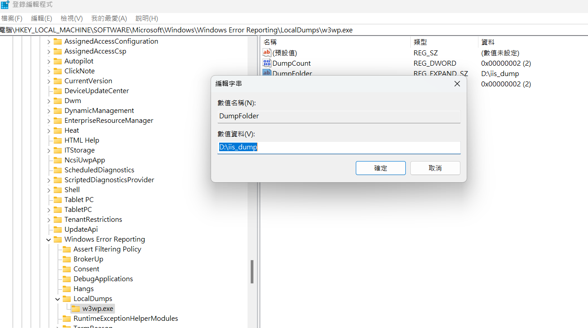
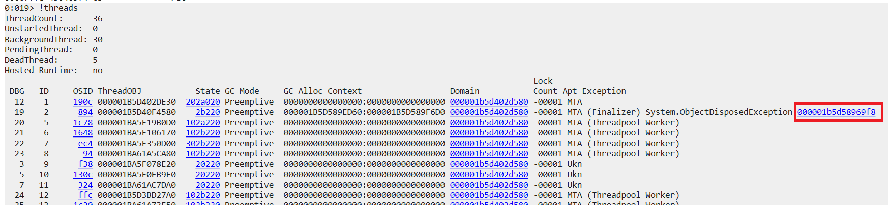

# IIS Dump

- 問題背景:某系統IIS不定時重啟，查看事件檢視器之後發現"was 5011"紀錄

## 截圖

- server執行iis_dump.reg以套用註冊碼，或是自行修改，目的為保存dump檔

- 安裝WinDbg以查看dump檔
- [Microsoft下載連結](https://learn.microsoft.com/zh-tw/windows-hardware/drivers/debugger/)

- 以WinDbg開啟dump檔，輸入指令:!threads，可以看到有個thread有出現Exception，點選後可查看stacktrace

- 或是直接輸入指令:!clrstack，可以直接查看stacktrace