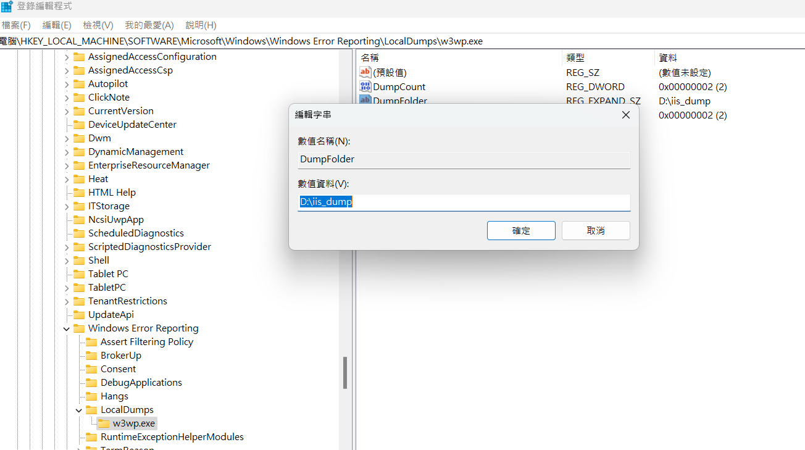
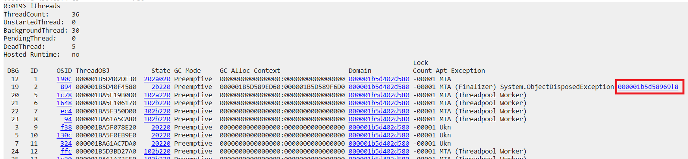

# IIS Dump

- 問題背景：某系統 IIS 不定時重啟，查看事件檢視器之後發現 was 5011 紀錄

## 處理過程

- 系統本身的 log 並沒有相關訊息，windows事件檢視器也只有 5011 紀錄，可能需要由 dump 檔取得更詳細資訊
1. server 執行 [iis_dump.reg](iis_dump.reg) 以套用註冊碼，或是自行修改，目的為保存 dump 檔

2. 安裝 WinDbg 以查看 dump 檔，[Microsoft下載連結](https://learn.microsoft.com/zh-tw/windows-hardware/drivers/debugger/)

3. 以WinDbg開啟dump檔，輸入指令：!threads，可以看到有個 thread 有出現 Exception，點選後可查看 stacktrace，或是直接輸入指令：!clrstack，可以直接查看 stacktrace

- 查看 stacktrace 後發現是一個類別的解構子執行時發生錯誤，修正後即正常

## 備註

- 透過配置 regedit 抓取的特性是只有在程序「真的當掉」的那一瞬間才會自動抓，如果要在運行時手動進行抓取可以進入工作管理員，找到該 w3wp.exe 右鍵 →「建立傾印檔案」