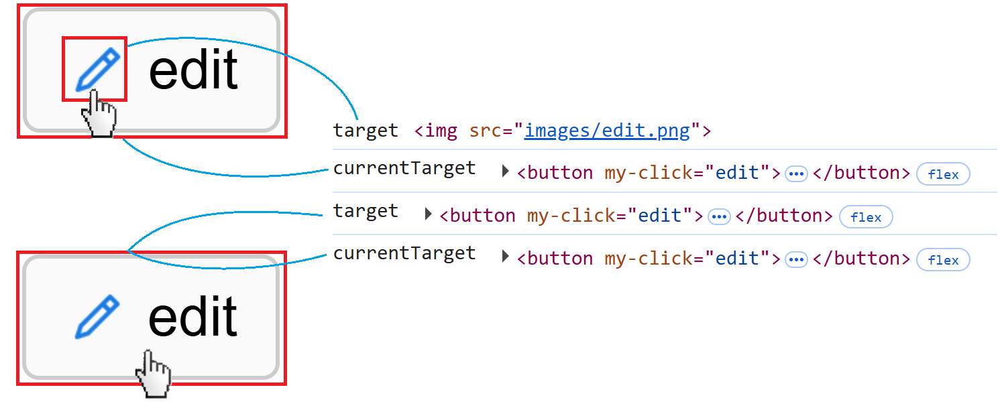
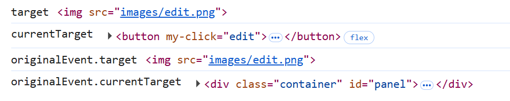

# JQuery event delegate application and currentTarget behavior

- 這個範例背景是 ASP.NET Core MVC 網頁，不同於現在較流行的前端框架 render DOM，範例網頁 DOM 元素是透過後端 render 動態產生

- 這樣的背景下，我們會使用 JQuery 事件委派 (event delegation) 來處理網頁上的事件，並與 ES6 Class 結合，例如：

```javascript
this.panel.on('click', '[my-click]', (e) => {
    const $target = $(e.currentTarget);
    const funcName = $target.attr('my-click');
    const func = this[funcName];
    if (typeof func === 'function')
        func.call(this, $target);
});
```

## 範例

html：

```html
<button my-click="edit">
<button my-click="remove">
```

對應 javascript：

```javascript
edit($btn) { ... }
remove($btn) { ... }
```

- 這樣的事件委派方式有幾個好處：
  - 動態加入的 DOM 自動擁有事件，不需要重新綁定
  - 只需綁定一個事件處理器，比起逐一綁定減少記憶體使用
  - 透過這種方式綁定事件的 DOM 在刪除時不需要手動解除事件
  - 事件綁定在程式碼中集中管理，事件邏輯更直覺、較易維護

## JavaScript 中的 target 與 currentTarget

- `event.target`：實際觸發事件的元素，為**觸發者**
- `event.currentTarget`：事件處理器所綁定的元素，為**被監聽者**

- 以這個範例的 edit 按鈕來說
  - 點選到按鈕內的 icon，此時 `event.target` 會是被點選的 icon，而 `event.currentTarget` 則會是按鈕本身
  - 點選到按鈕本身，此時 `event.target` 與 `event.currentTarget` 都會是按鈕本身




## JQuery event delegate

- Q：回到這個範例，事件本身綁定在 `this.panel`，為何 `event.currentTarget` 會是按鈕本身呢?
- A：這是 JQuery 的特性，會將 Event Object 做包裝處理，而 `event.currentTarget` 在事件委派中會被設定為當前事件冒泡階段的 DOM，因此由結果來看 `event.currentTarget` 就像是用原生 JavaScript 直接對按鈕綁定事件時的 `event.currentTarget` 一樣

- 參考：[Why does e.currentTarget change with jQuery's event delegation? - stackoverflow](https://stackoverflow.com/questions/44831556/why-does-e-currenttarget-change-with-jquerys-event-delegation)

### JQuery originalEvent

- 使用 JQuery 事件委派時可以透過 `event.originalEvent` 取得原生 JavaScript 事件物件如：

```javascript
this.panel.on('click', '[my-click]', (e) => {
    console.log('target', e.target);
    console.log('currentTarget', e.currentTarget);
    console.log('originalEvent.target', e.originalEvent.target);
    console.log('originalEvent.currentTarget', e.originalEvent.currentTarget);
});
```

- 可以看到原生 JavaScript 事件 `currentTarget` 是綁定事件的元素 `this.panel`，而非按鈕本身

