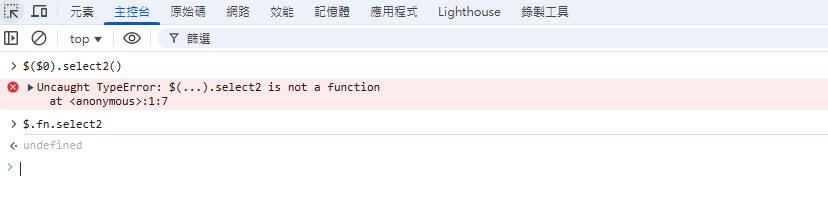
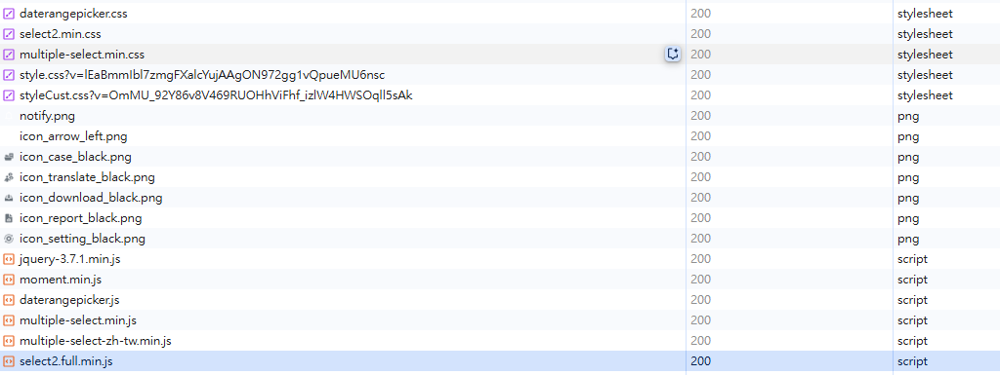

# JQuery plugin undefined Troubleshooting

- 問題背景：在一個 ASP.NET Core MVC 網站中 layout 引入 JQuery 與 select2、JQuery-ui 等 plugin，在特定的頁面載入後發現 select2 失效了，但經由 Network 面板檢查，相關的 js 檔案都有正確載入





## 處理過程

- 檢查變更程式，發現在一個 partial view 中再次引入了 JQuery
- 特定的頁面會使用到這個 partial view 導致 JQuery 被重新載入，重新載入的 JQuery 已不包含 plugin 定義的方法導致失效
- 移除後即恢復正常

## Alternative Debugging Methods

### 1. Script 標籤檢查法

- 這個方法可以在不修改程式碼的情況下，透過 console 檢查頁面中的 jQuery 引入情況
```javascript
document.querySelectorAll('script[src*="jquery"]').forEach(s => {
    console.log("script:", s.src);
});
```

- 限制：此方法無法檢測到特定 script 標籤載入的情況
  - 名稱不一致的 script
  - 動態載入的 script
  - 載入後被移除的 script 標籤

### 2. Proxy 偵測法
- 在 script 載入前加入一段程式檢查，這個方法的優點是可以捕捉到任何對 jQuery 物件的重新賦值，不論是通過什麼方式載入的

```javascript
let _jq = null;
Object.defineProperty(window, "jQuery", {
    configurable: true,
    get() { return _jq; },
    set(v) {
        if (_jq) {
            console.warn("jQuery 被賦值", v);
        }
        _jq = v;
    }
});
```