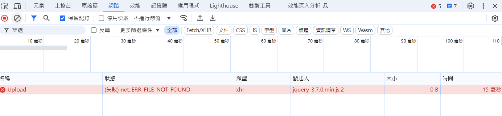
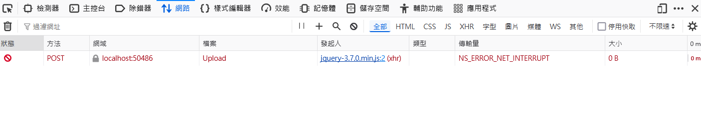

# JavaScript File Accessibility Validate

- JavaScript 確認檔案的可存取性

## 問題描述

在網頁使用 xhr 上傳檔案時，可能會遇到以下情境導致上傳失敗：
1. 使用者選擇檔案後，將該檔案移動到其他資料夾
2. 使用者選擇檔案後，將該檔案刪除
3. 使用者選擇檔案後，將該檔案改名
4. 因為其他原因檔案無法讀取

## 不同瀏覽器的行為差異

- **Chrome**：
  - 顯示 `ERR_FILE_NOT_FOUND` 錯誤，xhr 請求沒到達伺服器端

- **Firefox**：
  - 傳輸量顯示 `NS_ERROR_NET_INTERRUPT` 錯誤，xhr 請求到達伺服器端，但伺服器端給的回應沒有顯示

## 實作檔案可存取性檢查

- 使用 [JavaScript 函數](validate.js) 來預先驗證檔案的可存取性

1. `validateFormDataFileAccessible(formData)`：
   - 接收 FormData 物件作為參數
   - 遍歷所有欄位，找出檔案類型的欄位進行驗證
   - 回傳 Promise 物件，包含驗證結果

2. `validateFileAccessible(file)`：
   - 接收 File 物件作為參數
   - 使用 FileReader 嘗試讀取檔案的第一個 byte
   - 如果讀取成功，表示檔案可以存取
   - 如果讀取失敗，表示檔案可能已被移動或刪除

## 檢測漏洞

- 推測可能原因是 `File` 型別的資料有緩存機制

如果依照以下流程：
1. 選擇檔案
2. 刪除本機原始檔案
3. `validateFileAccessible` 第一次訪問 file，此時 `file.size` 會取得 0
4. 由於 `file.size` 為 0，即使 `FileReader` 讀取的檔案不存在也不會觸發 `onerror`
5. 結果：無法正確檢測出檔案已被刪除

## 補正方案

- 如果不允許上傳空檔案，在 `validateFileAccessible` 檢查 `file.size` 即可
- 在 `input[type="file"]` 的 `onchange` 事件中立即訪問 `file.size` 屬性，之後刪除本機原始檔案，驗證時 `FileReader` 讀取的檔案不存在就可以觸發 `onerror`