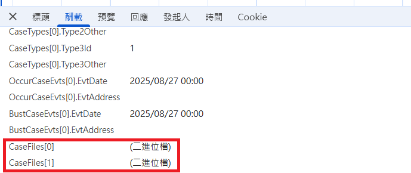

# JavaScript FileList Note

- FileList 是一個類陣列(array-like)的物件，通常由檔案輸入元件 `<input type="file">` 或拖放(drag、drop)操作產生，FileList 裡面包含一個或多個 File 物件，每個 File 物件代表一個使用者選擇的檔案
- FileList 是唯讀的，不能直接 new FileList() 或修改其內容

## 在網頁取得 FileList

- 使用者操作(選擇、拖放)時可以取得 FileList，瀏覽器不允許 javascript 任意讀取本機檔案

1. 透過 input 元素的 files 屬性
```javascript
// HTML: <input type="file" id="uploadFiles" multiple>

const files = document.getElementById('uploadFiles').files;  // files
```

2. 透過拖放事件 (Drag and Drop)
```javascript
const dropZone = document.getElementById('dropZone');

dropZone.addEventListener('drop', function(event) {
    event.preventDefault();
    const files = event.dataTransfer.files;  // files
});

dropZone.addEventListener('dragover', function(event) {
    event.preventDefault();
});
```

## FileList 操作範例

- FileList 是唯讀，但可透過 DataTransfer 物件來建立新的 FileList。範例為複合 input 元素與拖放事件選取檔案，將檔案資訊儲存於 javascript 物件中，在適當時機再轉為 FileList

```javascript
let selectedFiles = new Map();
function addFiles(files) {
    for (const file of files) {
        const fileKey = file.name + '_' + file.size;
        // check duplicate ...
        selectedFiles.set(fileKey, file);
    }
}

fileInput.addEventListener('change', (e) => {
    addFiles(e.target.files);
    fileInput.value = '';
});

dropZone.addEventListener('drop', function(event) {
    event.preventDefault();
    addFiles(event.dataTransfer.files);
});

// 將 Map 內儲存的檔案資訊轉為 FileList
function getFiles() {
    const dataTransfer = new DataTransfer();
    for (const file of selectedFiles.values()) {
        dataTransfer.items.add(file);
    }
    return {
        CaseFiles: dataTransfer.files
    };
}
```

## Binding - 以 ASP.NET Core MVC 為例

- ASP.NET Core MVC 可以直接將 FileList 綁定至 List<IFormFile>，ViewModel 與 html 範例如下

```csharp
public class UploadFilesViewModel
{
    /// <summary> 上傳檔案 </summary>
    public IList<IFormFile> CaseFiles { get; set; } = [];
}
```

```html
<input type="file" name="CaseFiles" multiple />
```

- 如果使用原生表單提交或是由表單直接生成 FormData 物件則不需要特別處理；如果是自行使用 JavaScript 建立 FormData 物件，則需要注意 binding 規則
- FileList 與一般 array-like 結構的 binding 規則不同，並不支援用 [index] 的方式去綁定 IFormFile 集合
- 如下的表單欄位名稱 (Form field name) 送到後端之後是無法正確 binding 的  



- 如下範例為正確的表單欄位名稱  
