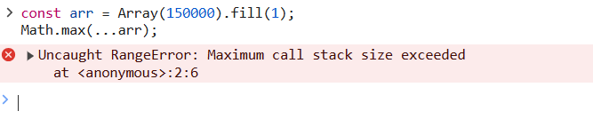

# JavaScript Function Call Parameter Limits

- JavaScript 引擎對函數參數有數量限制，使用展開運算符時需要注意

- 例如使用展開運算符作為傳入 `Math.max` 參數，參數過多時會導致 `Maximum call stack size exceeded` 錯誤：
  

```javascript
const arr = Array(150000).fill(1);
Math.max(...arr);
```

-  `Maximum call stack size exceeded` 指的是函數調用堆疊的大小超過了限制，除了在大量遞迴呼叫，傳入參數過多時也會導致這個錯誤

## 修改方法

- 使用 `reduce`

```javascript
const arr = Array(150000).fill(1);
arr.reduce((a, b) => Math.max(a, b), -Infinity);
```