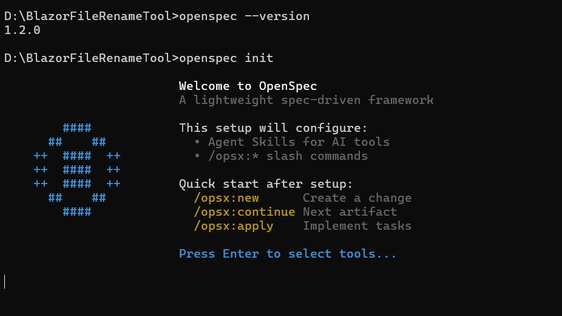
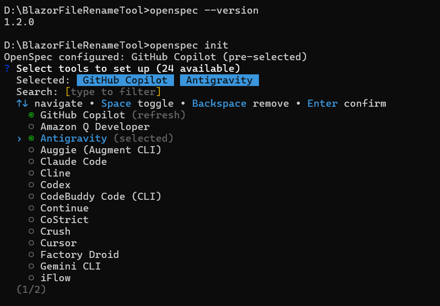
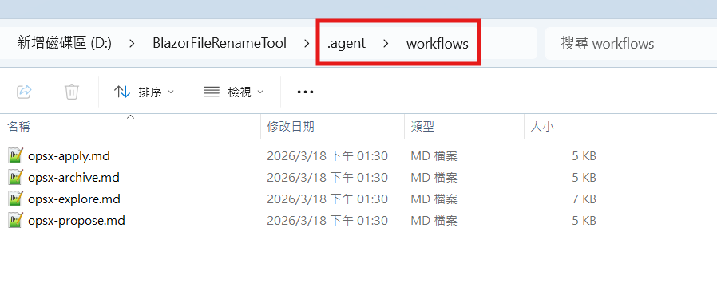

# OpenSpec 規格驅動開發 Note
- [OpenSpec](https://github.com/Fission-AI/OpenSpec) 規格驅動開發，核心理念在於讓 AI 開始寫程式碼之前，透過一套規格文件（Specs）與開發者達成共識，作為之後實作的基準

## 安裝
- OpenSpec 的本質是給 AI 工具注入「技能」與定義「工作流」

### 1. 安裝 Node.js
版本 20.19.0 以上

### 2. 安裝 OpenSpec
完成後可以輸入 `openspec --version` 來確認安裝成功
```bash
npm install -g @fission-ai/openspec@latest
```

### 3. 初始化專案
切換到專案資料夾輸入指令
```bash
openspec init
```


按下 Enter 之後指定要使用的 AI 工具


會依據選取的工具產生對應的 skill/workflow/command 等目錄與檔案，以 Antigravity 為例，會產生以下結構：


這也對應了 OpenSpec 的基本 [Commands](https://github.com/Fission-AI/OpenSpec/blob/main/docs/commands.md) 
- `/opsx:propose`
- `/opsx:explore`
- `/opsx:apply`
- `/opsx:archive`