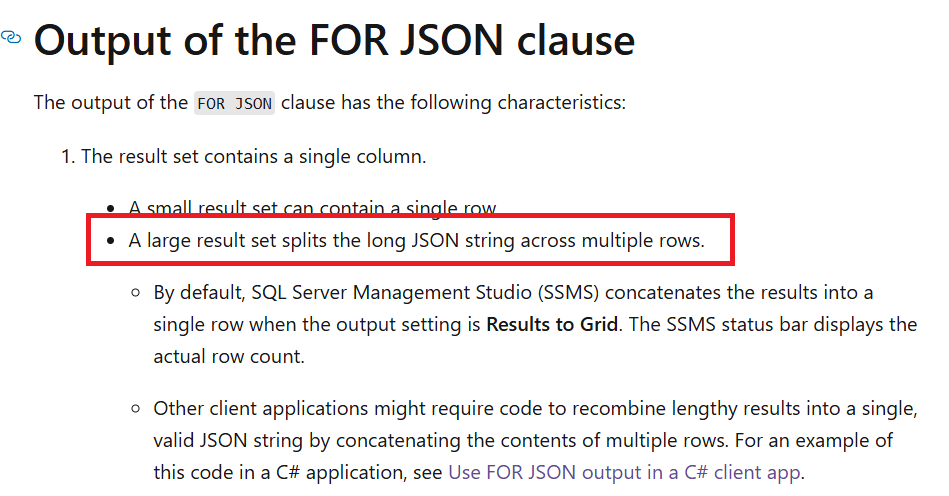
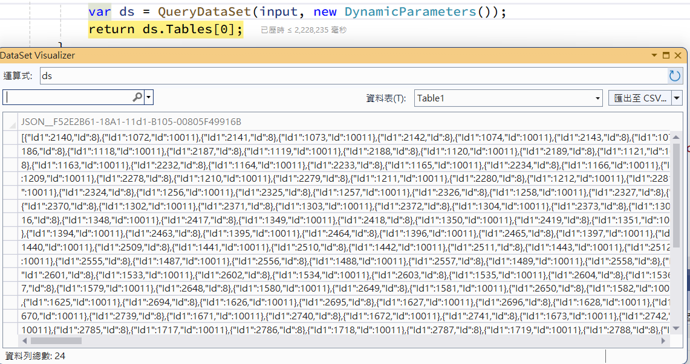

# SQL Server For JSON Path

- `FOR JSON PATH` 是 SQL Server 提供的一種功能，用於將查詢結果轉換為 JSON 格式

## 基本語法

- 在 SQL 查詢中使用 `FOR JSON PATH`，可以將結果集轉換為 JSON 格式

```sql
SELECT EmployeeID, Name, Position FROM Employees FOR JSON PATH;
```

## 使用注意



- 大型的查詢結果會將 JSON 字串拆分為多列
- 在 SSMS 中執行時結果會顯示為單一資料列，但其他應用程式則可能需要手動處理



- [Microsoft](https://learn.microsoft.com/en-us/sql/relational-databases/json/format-query-results-as-json-with-for-json-sql-server?view=sql-server-2017&tabs=json-path#output-of-the-for-json-clause)
- [StackOverflow](https://stackoverflow.com/questions/55316598/how-to-prevent-returned-json-being-split/55731668)