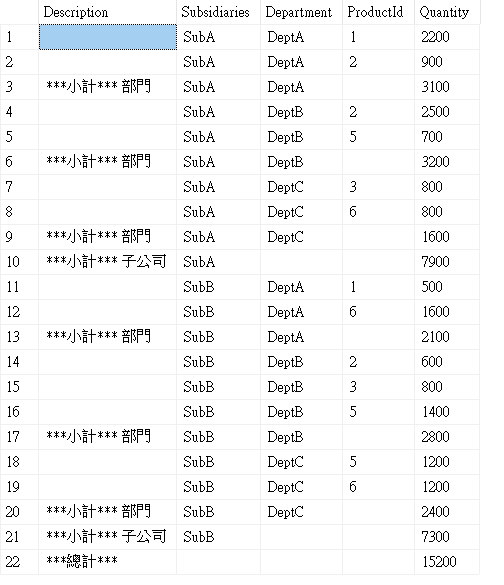

# SQL Server grouping sets

- grouping sets 是 SQL Server 中的一個進階分組功能，允許在單一查詢中同時執行多個 group by
- 原本需要多個 group by 之後再 union 的查詢可一次完成
- 適合需要產生報表和數據分析的情境，如：庫存管理報表，按照區域、單位、倉庫等多層分析


## 基本語法範例

- grouping sets 手動指定分組方式：

```sql
select 欄位1, 欄位2, 統計函數
from 資料表
group by grouping sets (
    (欄位1, 欄位2), -- 第一種分組方式
    (欄位1),       -- 第二種分組方式
    (欄位2),       -- 第三種分組方式
    ()            -- 全部統計
);
```

- 如果是特定情境也可以直接使用 CUBE 與 ROLLUP 的分組方式
- 範例檔：[example.sql](example.sql)

## CUBE 與 ROLLUP

- CUBE(d1，d2，d3) 會產生所有可能的分組：
```sql
(d1, d2, d3)
(d1, d2)
(d2, d3)
(d1, d3)
(d1)
(d2)
(d3)
()
```

- ROLLUP(d1，d2，d3) 會依照層次結構產生分組：
```sql
(d1, d2, d3)
(d1, d2)
(d1)
()
```