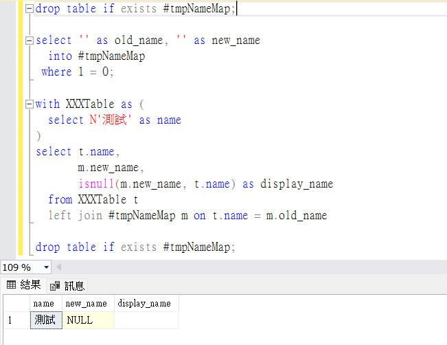
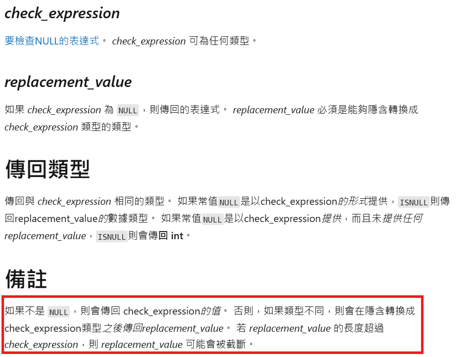

# SQL Server isnull 型別轉換問題

## 情境描述

- 背景：在開發過程中由於實際資料表尚未建立完成，先建立暫存表來模擬資料結構以完成後續的查詢邏輯開發，但在後續查詢時遇到了型別轉換的問題

## 問題描述

- 範例檔：[example.sql](example.sql)
- 在建立暫存表後進行 left join 查詢，發現原本預期 display_name 應該顯示為 `t.name` ，結果卻為空字串


```sql
/* 建立暫存表模擬對應表 */
select '' as old_name, '' as new_name 
  into #tmpNameMap
 where 1 = 0;

/* 查詢語句 */
select isnull(m.new_name, t.name) as display_name
  from XXXTable t
  left join #tmpNameMap m on t.name = m.old_name
```

## 原因

- 依據 Microsoft 文件說明，`isnull(check_expression, replacement_value)` 會使用第一個參數的資料類型


- 建立暫存表語法產生的欄位為 varchar(1)，因此發生了截斷

## 解決方法

### 1.建立暫存表語法指定型別

```sql
select cast(null as varchar(100)) as old_name, 
       cast(null as varchar(100)) as new_name 
  into #tmpNameMap 
 where 1 = 0;
```

或是

```sql
select name as old_name, 
       name as new_name 
  into #tmpNameMap 
  from XXXTable
 where 1 = 0;
```

### 2.查詢語法使用 coalesce

```sql
select coalesce(m.new_name, t.name) as display_name
  from XXXTable t
  left join #tmpNameMap m on t.name = m.old_name
```

## 語法對比

```sql
select isnull(cast(null as varchar(1)), 'LongString');  -- 結果被截斷為 'L'

select coalesce(cast(null as varchar(1)), 'LongString');  -- 結果為完整的 'LongString'
```

## 參考

- [Microsoft isnull 說明](https://learn.microsoft.com/zh-tw/sql/t-sql/functions/isnull-transact-sql)
- [Microsoft coalesce 說明](https://learn.microsoft.com/zh-tw/sql/t-sql/language-elements/coalesce-transact-sql)


