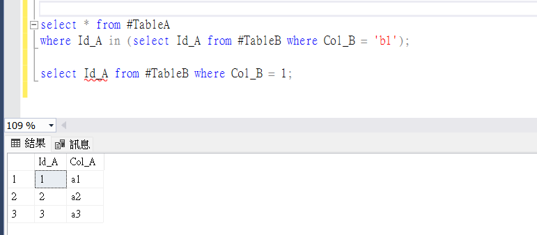
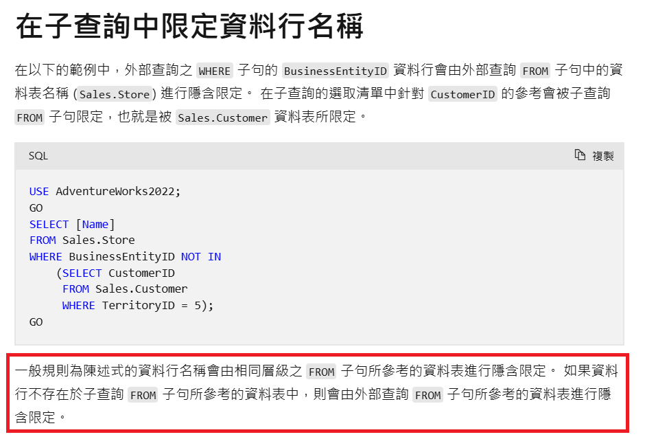

# SQL Server 子查詢欄位名稱解析筆記

- 背景：在 SQL Server 子查詢引用一個在其資料表中不存在的欄位時，SQL Server 會嘗試從外層查詢中尋找該欄位，這樣的狀況 SQL 執行不報錯，但可能會產生非預期的結果


## 範例情境

- 範例檔：[example.sql](example.sql)

```sql
select * from #TableA
 where Id_A in (select Id_A from #TableB where Col_B = 'b1');
```
- 範例中 `Id_A` 欄位不存在於 `#TableB`，但 SQL 語法仍可執行，因子查詢的 `Id_A` 欄位解析為 `#TableA` 的
- 如果輸入了錯誤的欄位名稱，且該名稱存在於子查詢外層沒有語法錯誤，在未察覺的狀況下可能產生非預期的結果

## 推薦實作

- 明確指定欄位來源
```sql
select a.* from #TableA a
 where a.Id_A in (select b.Id_A from #TableB b where b.Col_B = 'b1');
```

## 參考

- [Microsoft Learn](https://learn.microsoft.com/zh-tw/sql/relational-databases/performance/subqueries?view=sql-server-ver16#qualifying)
