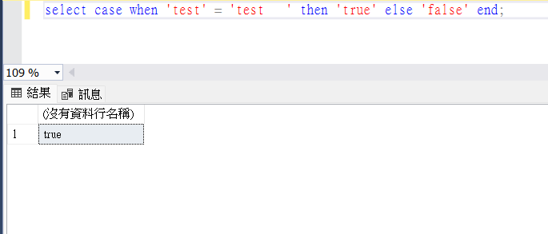
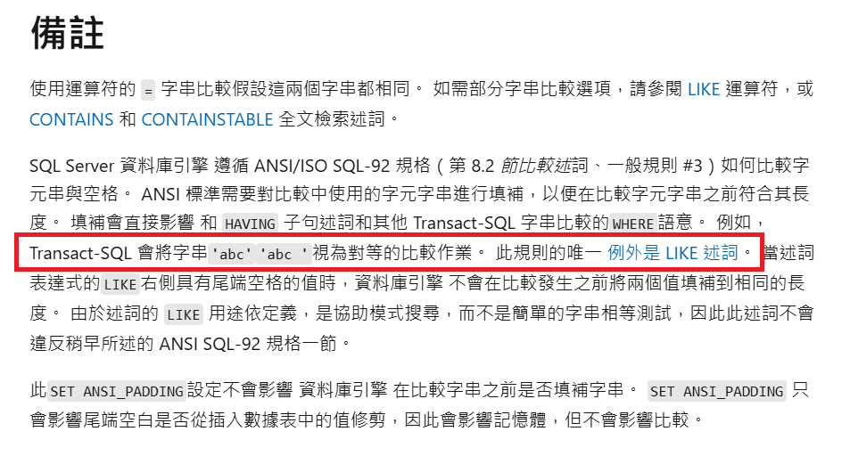

# SQL Server 字串檢索空白處理

- SQL Server 在進行字串比較和搜尋時，預設會忽略後方空白字元的差異，而 Oracle 資料庫則不會忽略後方空白字元的差異
- 如果遇到使用程式檢索與使用 SQL Server 資料庫檢索結果不一致的狀況，除資料庫定序外也有可能是因為是後方空白字元所造成


## 範例

- 範例檔：[example.sql](example.sql)

```sql
-- 以下兩個比較會得到 'true'
select case when 'test' = 'test   ' then 'true' else 'false' end;
select case when 'test   ' = 'test' then 'true' else 'false' end;
```

```sql
-- 以下兩個查詢會得到相同的結果
select * from tablename where column1 = 'test';
select * from tablename where column1 = 'test   ';
```

## 參考

- [Microsoft Learn](https://learn.microsoft.com/zh-tw/sql/t-sql/language-elements/string-comparison-assignment?view=sql-server-ver16#remarks)