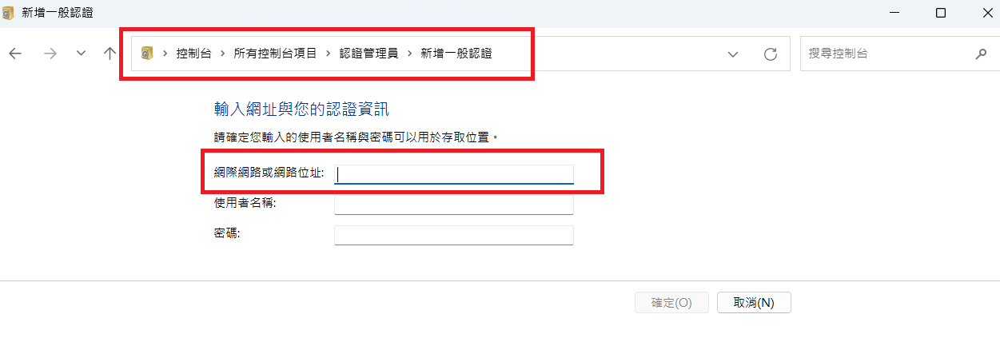

# SSMS 20 記住認證密碼

- 簡介：SQL Server Management Studio (SSMS) 20 版本會將登入認證儲存在 Windows 認證管理員的一般認證中。當認證資料被清空時也代表著 SSMS 密碼需要重新輸入，可以使用 cmdkey 指令快速重新設定。

## 使用步驟

### 1. 查看已儲存的 SSMS 認證
```cmd
cmdkey /list | findstr "SSMS"
```

- 如果目前記下了 192.168.100.100 的 SSMS 認證，console 應輸出：
```cmd
    目標: LegacyGeneric:target=Microsoft:SSMS:20:192.168.100.100:user001:8c91a03d-f9b4-46c0-a305-b5dcc79ff907:1
```

- 其中 Microsoft:SSMS:20:192.168.100.100:user001:8c91a03d-f9b4-46c0-a305-b5dcc79ff907:1 這一串就是新增一般認證時要輸入的名稱


### 2. 新增或更新 SSMS 認證
```cmd
cmdkey /generic:[認證名稱] /user:[使用者名稱] /pass:[密碼]
```

- 以登入 192.168.100.100 帳密 user001 / pwd001 為例
```cmd
cmdkey /generic:Microsoft:SSMS:20:192.168.100.100:user001:8c91a03d-f9b4-46c0-a305-b5dcc79ff907:1 /user:user001 /pass:pwd001
```

- bat 範例檔：[example.bat](example.bat)
