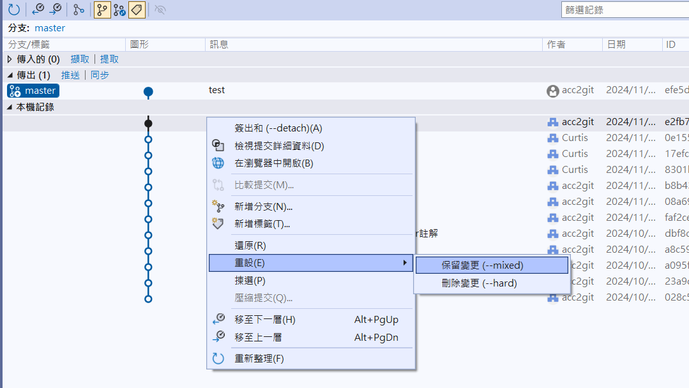

# Visual Studio 中的 Git Reset

- 目標：使用 Visual Studio UI 將 "test" 退掉
- 方法：對著上個版本的點選右鍵，執行重設。 **注意是點選上個版本，不是 "test" 這個**
- 示意圖片為 Visual Studio 2022

## Git Reset 概念

Git Reset 是用來將目前的 HEAD 移動到指定的 commit，主要有三種模式：
- --soft：保留工作目錄和暫存區的內容
- --mixed：保留工作目錄但清空暫存區 (預設模式)
- --hard：清空工作目錄和暫存區

## 參考
[【狀況題】剛才的 Commit 後悔了，想要拆掉重做…](https://gitbook.tw/chapters/using-git/reset-commit)