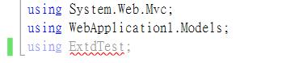
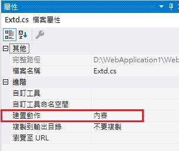
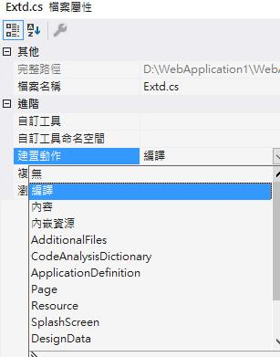
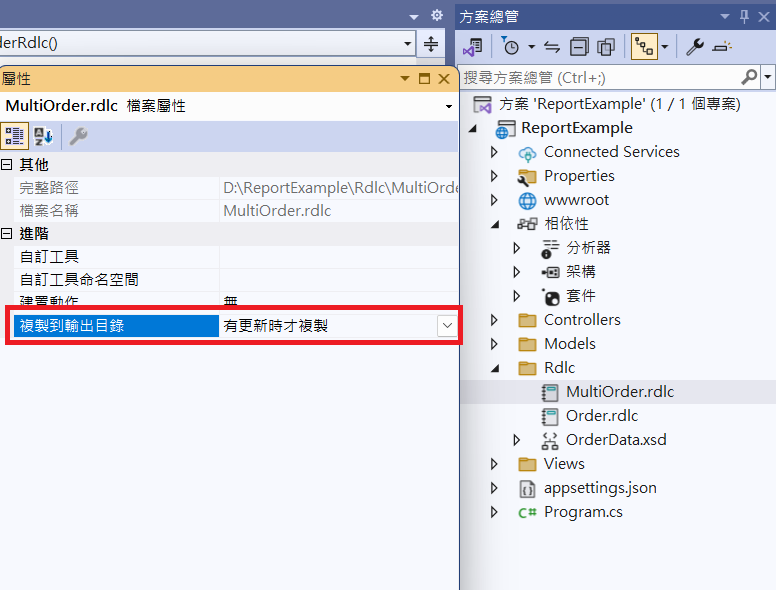
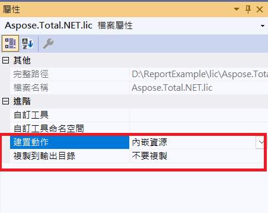

# Visual Studio 建置屬性

- 紀錄一些因為檔案建置屬性不正確產生的問題

## 1. 程式碼檔案 (.cs) 未參與編譯

- 問題：新增的 .cs 檔案未被編譯進專案  


- 檢查方式：檢視檔案屬性中的「建置動作」(Build Action)  


- 解決方法：將「建置動作」設為「編譯」(Compile)  


- 註：此區圖片為 Visual Studio 2017 所截取，可能與目前不同

## 2. 設定檔未複製到輸出目錄

- 問題：NLog.config 與報表範本檔案 .rdlc 檔未複製到輸出目錄

- 解決方法：將「複製到輸出目錄」設為「有更新時才複製」或「永遠複製」



## 3. 內嵌資源設置

- 問題：如何設置內嵌資源(如 License 檔)? 內嵌資源是否需要複製?

- 解決方法：將「建置動作」設為「內嵌資源」，將「複製到輸出目錄」設為「不要複製」

- 說明：內嵌資源會直接嵌入到 DLL 或 EXE 中，成為程式的一部分，因此不需要被複製到輸出目錄


- 使用程式存取資源範例：
```csharp
var assembly = Assembly.GetExecutingAssembly();
var stream = assembly.GetManifestResourceStream("Namespace.FileName.lic");
```