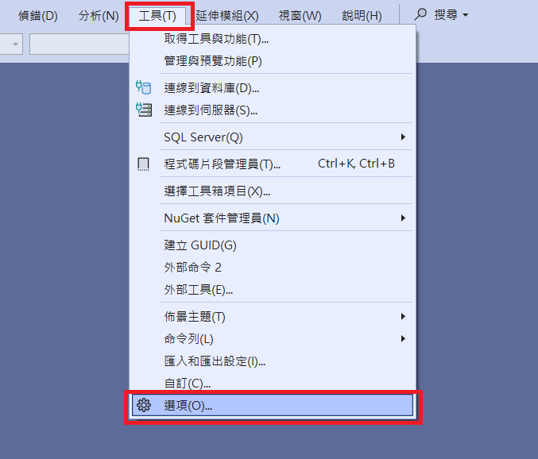

# Visual Studio 設定

- 紀錄一些 Visual Studio 設定

## 字型設定

- 工具 > 選項 > 環境 > 字型和色彩


## 編碼設定

- 工具 > 自訂 > 命令 > 檔案 > 加入命令 > 檔案 > 進階儲存選項


## 編碼設定 - Visual Studio 2022 v17.13

- 工具 > 選項 > 環境 > 文件




## editorconfig

- 在專案目錄加入 `.editorconfig` 也可以設定編碼：

```editorconfig
# Code files
[*.{cs,csx,vb,vbx}]
charset = utf-8-bom
```

- 參考 [Roslyn](https://raw.githubusercontent.com/dotnet/roslyn/refs/heads/main/.editorconfig)

## Code Snippet

- 工具 > 程式碼片段管理員 > 語言


- Example：
  - C# `prop`：建立自動實作屬性
  - C# `tryf`：建立 try finally 片段
  - JavaScript `iife`：建立立即執行函數
  
## GitHub Copilot generate commit message
- 工具 > 選項 > GitHub > Copilot
- 輸入自訂指示模板用於生成 commit message 如：

```
The format is:
"<type>(<scope>): <subject>
<BLANK LINE>
<body>
"
type:feat, fix, docs, style, refactor, test, chore, build, ci, perf
body: Use markdown to describe the changes in bullet points, each starting with "- ".
```


## Collapse appsettings.json
- 在 Console 或 WinForm 專案收合 appsettings.json

**before：**  
  

**setting：**  
  

**after：**  
  


## 關閉瀏覽器時不停止偵錯

- 工具 > 選項 > 專案和方案 > Web專案

  


## Git user 設定

- `Git > 設定` 的 `user.name` 和 `user.email` 會影響 commit 的作者資訊，但是 Visual Studio 的介面只能修改全域設定，全域設定會被儲存到使用者的 `~/.gitconfig` 檔案中，會影響所有專案


- 如果需要修改專案特定的設定，可以直接編輯 `.git/config` 這個檔案的 user 區塊如：


```
[user]
    name = Your Project Specific Name
    email = your-email@project.com
```

## 專案屬性

- nullable 提示未啟用：


- 啟用 nullable 提示，可透過 `專案 > 右鍵 >  屬性` 調整，會自動更新 `.csproj` 檔案：


- 或在 `.csproj` 檔案中手動調整：
```xml
<PropertyGroup>
  <Nullable>enable</Nullable>
</PropertyGroup>
```

- 啟用後會在程式碼中顯示 nullable 提示：


## 建置時顯示詳細的訊息

- `工具 > 選項 > 專案和方案 > 建置和執行`，調整為 `詳細` 或 `診斷`，可以看到更詳細的建置訊息

