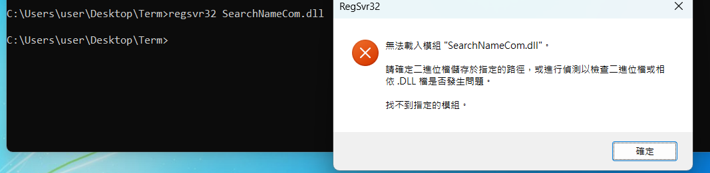

# Windows IIS COM 32-bit DLL 部署 Troubleshooting

- 背景：ASP.NET MVC 網站整合第三方 32-bit COM DLL，但專案直接打包 Interop DLL 並直接參考，build 階段無任何提示，新接手維護者首次執行時觸發 runtime error 才發現 COM 元件未安裝
- 呼叫 COM 元件時出現 `REGDB_E_CLASSNOTREG (0x80040154)`
```
System.Runtime.InteropServices.COMException (0x80040154): 擷取元件 (CLSID 為 {7A329A9D-7297-45AE-998A-09312B203D04}) 的 COM Class Factory 失敗，因為發生下列錯誤: 
80040154 類別未登錄 (發生例外狀況於 HRESULT: 0x80040154 (REGDB_E_CLASSNOTREG))
```
- 要使用 `regsvr32` 安裝 COM 元件，但因古老專案文件缺失導致安裝過程遭遇許多問題，所幸在 AI 協助下逐一解決。在此記錄排錯過程，以下將以 `ThirdPartyCom.dll` 代表這次要安裝的 COM 元件，powerShell 指令則是貼到 `Windows PowerShell ISE` 執行

## 安裝錯誤


- 執行 `regsvr32 ThirdPartyCom.dll` → 「找不到指定的模組」
- DLL 檔案確實存在於目錄中，但仍然失敗

## 初步推測原因

- 執行 `regsvr32 ThirdPartyCom`（不帶副檔名）→ 錯誤訊息改為「版本可能不相容」→ 推測是 DLL 架構與 regsvr32 不符
- 用 PowerShell 確認 DLL 架構：

```powershell
$bytes = [System.IO.File]::ReadAllBytes("C:\...\ThirdPartyCom.dll")
$peOffset = [BitConverter]::ToInt32($bytes, 0x3C)
$machine = [BitConverter]::ToUInt16($bytes, $peOffset + 4)
if ($machine -eq 0x14c) { "32-bit (x86)" } elseif ($machine -eq 0x8664) { "64-bit (x64)" } else { "Unknown: 0x" + $machine.ToString("X") }
```

- 結果：`32-bit (x86)` → 改用 `C:\Windows\SysWOW64\regsvr32.exe` 來註冊

> [!NOTE]  
> `regsvr32` 回報「找不到指定的模組」不一定是目標 DLL 本身找不到，可能是它的相依 DLL 缺失

## 改用 32-bit regsvr32 仍然失敗

- 執行 `C:\Windows\SysWOW64\regsvr32.exe ThirdPartyCom.dll` → 同樣「找不到指定的模組」
- 用 32-bit PowerShell 呼叫 `LoadLibraryEx` 取得更詳細的 Win32 錯誤碼：

```powershell
C:\Windows\SysWOW64\WindowsPowerShell\v1.0\powershell.exe -Command {
    Add-Type -TypeDefinition @"
using System;
using System.Runtime.InteropServices;
public class NL {
    [DllImport("kernel32.dll", SetLastError=true, CharSet=CharSet.Auto)]
    public static extern IntPtr LoadLibraryEx(string f, IntPtr h, uint flags);
}
"@
    $r = [NL]::LoadLibraryEx("C:\...\ThirdPartyCom.dll", [IntPtr]::Zero, 0)
    if ($r -eq [IntPtr]::Zero) {
        $err = [System.Runtime.InteropServices.Marshal]::GetLastWin32Error()
        "Error $err : " + ([System.ComponentModel.Win32Exception]$err).Message
    }
}
```

- 結果：`Error 126 : The specified module could not be found`，代表相依 DLL 缺失，不是 ThirdPartyCom.dll 本身找不到

## 找出缺失的相依 DLL

- PowerShell 解析 PE import table：

```powershell
$path = "C:\...\ThirdPartyCom.dll"
$bytes = [System.IO.File]::ReadAllBytes($path)
$peOffset = [BitConverter]::ToInt32($bytes, 0x3C)
$importRVA = [BitConverter]::ToUInt32($bytes, $peOffset + 0x80)
$numSections = [BitConverter]::ToUInt16($bytes, $peOffset + 6)
$optHeaderSize = [BitConverter]::ToUInt16($bytes, $peOffset + 20)
$sectionOffset = $peOffset + 24 + $optHeaderSize

$sectionVA = 0; $sectionRaw = 0
for ($i = 0; $i -lt $numSections; $i++) {
    $so = $sectionOffset + $i * 40
    $va = [BitConverter]::ToUInt32($bytes, $so + 12)
    $sz = [BitConverter]::ToUInt32($bytes, $so + 16)
    $raw = [BitConverter]::ToUInt32($bytes, $so + 20)
    if ($importRVA -ge $va -and $importRVA -lt ($va + $sz)) {
        $sectionVA = $va; $sectionRaw = $raw; break
    }
}
$importOffset = $importRVA - $sectionVA + $sectionRaw
for ($i = 0; ; $i++) {
    $entry = $importOffset + $i * 20
    $nameRVA = [BitConverter]::ToUInt32($bytes, $entry + 12)
    if ($nameRVA -eq 0) { break }
    $nameOffset = $nameRVA - $sectionVA + $sectionRaw
    $name = ""
    for ($j = $nameOffset; $bytes[$j] -ne 0; $j++) { $name += [char]$bytes[$j] }
    $name
}
```

- 相依清單：`KERNEL32.dll`、`USER32.dll`、`ADVAPI32.dll`、`ole32.dll`、`OLEAUT32.dll`、`MSVCR100.dll`、`WS2_32.dll`
- 確認 `MSVCR100.dll` 是否存在：

```powershell
Test-Path "C:\Windows\SysWOW64\MSVCR100.dll"  # False → 缺失
Test-Path "C:\Windows\System32\MSVCR100.dll"   # True → 只有 64-bit 版
```

- 故推測安裝的是 x64 版 VC++ 2010 Redistributable，但 DLL 是 32-bit，需要 x86 版

## 修正：安裝正確架構的 VC++ Runtime

- 下載並安裝 `Visual C++ 2010 Redistributable (x86)`（Microsoft 下載中心搜尋 `vcredist_x86.exe 2010`）
- 安裝後 `C:\Windows\SysWOW64\MSVCR100.dll` 出現，重新執行 regsvr32 即正常

## IIS 中呼叫 COM 元件失敗

### REGDB_E_CLASSNOTREG (0x80040154)

- 現象：DLL 已成功註冊，但 ASP.NET 網站呼叫 COM 時出現 `REGDB_E_CLASSNOTREG`
- 確認 DLL 確實有在 registry 登記：CLSID 從 exception 訊息取得，查 WOW6432Node（32-bit COM 的 registry 位置）

```powershell
Get-Item "HKLM:\SOFTWARE\WOW6432Node\Classes\CLSID\{COM元件的CLSID}" -ErrorAction SilentlyContinue
```

- 有回傳結果即代表 DLL 已正確註冊，問題出在應用程式無法找到它
- 原因：DLL 是 32-bit，IIS App Pool 預設跑 64-bit，找不到 32-bit COM 的 registry 項目（位於 `WOW6432Node`）
- 修正：IIS 管理員 → 應用程式集區 → 進階設定 → 啟用 32 位元應用程式 → `True`

### E_ACCESSDENIED (0x80070005)

- 現象：啟用 32-bit 後改出現 `E_ACCESSDENIED`
- 原因：in-process COM 的 `regsvr32` 只是在 registry 寫下 DLL 路徑的指標，不複製 DLL 到系統目錄；IIS worker process 需要能讀取 DLL 所在的實際路徑
- 修正：對 DLL 所在資料夾授予 `IIS_IUSRS` 讀取+執行
