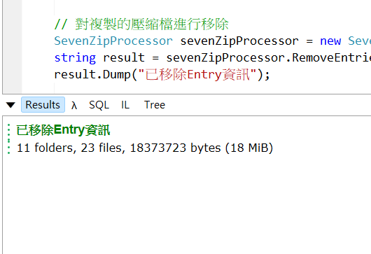

# C# 使用 7-Zip 移除壓縮檔指定內容

- 問題背景：用於交付 ZIP 檔案的前處理

## 功能說明

這是一個使用 LINQPad 的工具程式，用於批次移除指定 ZIP 檔案中的特定目錄或檔案。程式會先複製一份原始 ZIP 檔案並加上日期後綴，然後在新檔案上執行移除。

- 使用 7-Zip 批次移除 ZIP 檔案中指定的目錄或檔案
- 支援多個移除項目
- 執行完成後會在 LINQPad 結果區顯示移除資訊，如圖例：  


## 使用方式

### 1. 開啟 main.linq

### 2. 設定參數

在程式碼中設定以下參數：

```csharp
string filename = "test.zip";  // 目標ZIP檔案名稱
string zipExePath = @"C:\Program Files\7-Zip\7z.exe";  // 7-Zip執行檔路徑
var removeEntries = new List<string> {  // 要移除的目錄或檔案列表
    "/A",
    "/B",
    "/C/D/E"
};
```

### 3. 視需要補充後續處理

## 執行環境需求
- 需安裝 7-Zip
- 需要 LINQPad 執行環境
- 目錄需有讀取權限
- 注意硬碟空間

