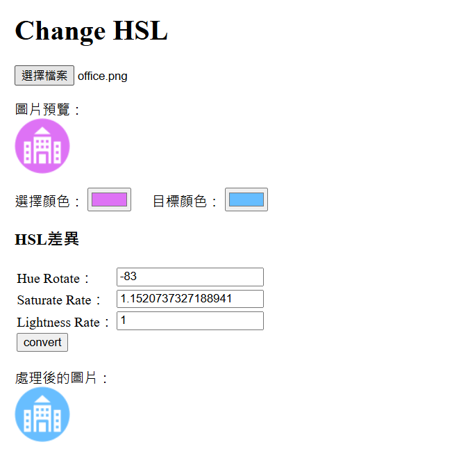

# Change HSL

- 用途：簡易將小型 icon 更改配色

## 功能簡介

- 這是一個網頁工具，可以調整圖片的 HSL (Hue, Saturation, Lightness) 色彩屬性。
- 圖片處理在瀏覽器端完成，不會上傳至伺服器，建議上傳適當大小的圖片以確保處理效能。

主要功能包括：
1. 上傳圖片進行預覽
2. 調整 HSL 值
3. 顯示處理後的圖片

## 使用方式

### 1. 上傳圖片
- 點選「選擇檔案」按鈕上傳要處理的圖片
- 上傳後會在「圖片預覽」區域顯示原圖

### 2. 點選預覽區
- 點選後會將點選位置的顏色帶入「選擇顏色」

### 3. 選取目標顏色
- 選取「目標顏色」後會計算與「選擇顏色」的 HSL 差異並帶入下方表單
- 表單可再自行調整

### 4. 轉換圖片
- 點選「Convert」按鈕進行轉換
- 依照表單的 HSL 差異進行轉換
- 處理後的圖片會顯示在下方

## 技術說明
工具使用純前端技術實現：
- HTML5 Canvas 進行圖片處理
- 原生 JavaScript 處理色相轉換邏輯 
