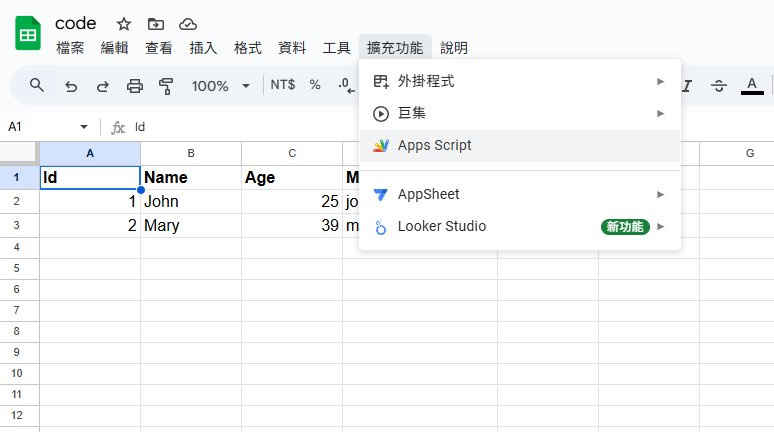
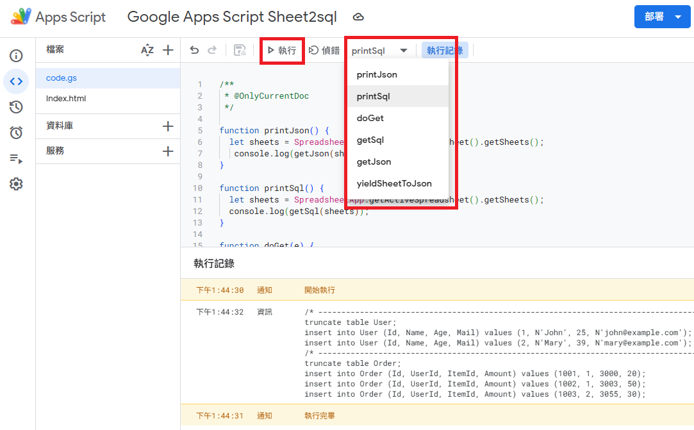
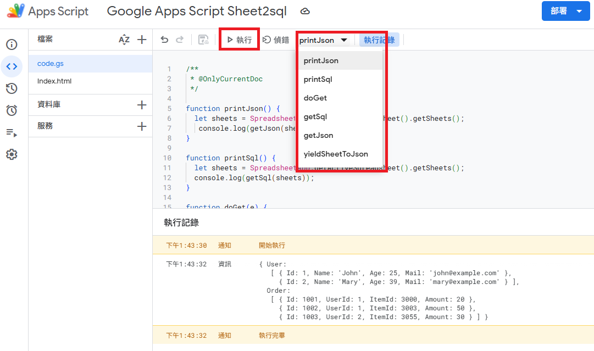

# Google Apps Script Sheet2sql  

## 使用

1. 建立 Google 試算表以及 Google Apps Script 專案
2. 在 Google Apps Script 專案建立 `Code.gs` 並貼上程式碼
3. 選取 function 點選執行
4. 授權訪問的 Google 試算表，執行後結果在下方顯示

## 範例
  

  

  

