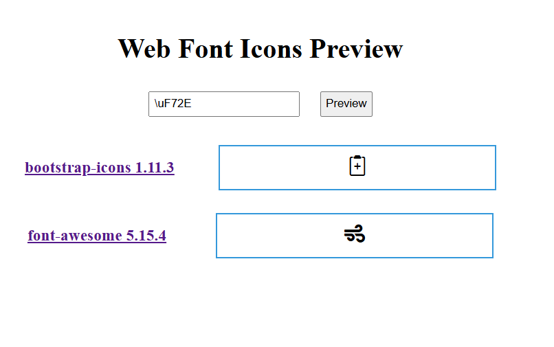

# Web Font Icons Preview

- 用途：輸入字型圖示對應的 Unicode 編碼可進行預覽。用於支援以 Unicode 方式插入圖示的 JavaScript 套件開發測試
- 支援 Bootstrap Icons、Font Awesome，可自行修改引入的 CSS 或是 Font

## 功能簡介

- 透過引入的字型檔在網頁上呈現結果，預設引入 Bootstrap Icons、Font Awesome，可自行修改引入的 CSS 與 Font
- 可快速確認 Unicode 配上指定的 Font 結果

## 使用方式

### 1. 輸入 16 進制 Unicode
- Unicode 可以在對應的 Bootstrap Icons 或 Font Awesome 網站查詢

### 2. 點選 Preview
- 點選後會在下方顯示結果
